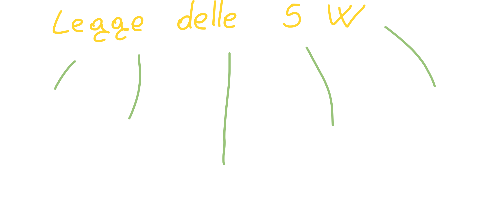
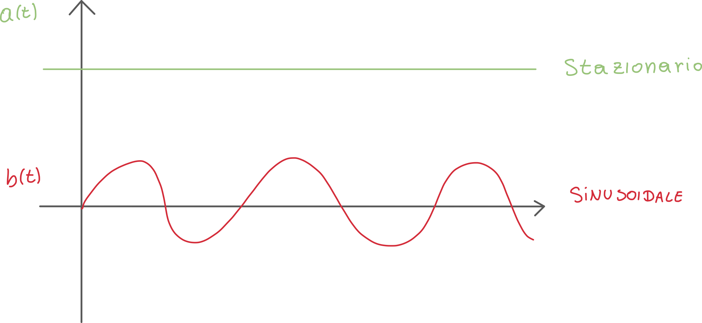
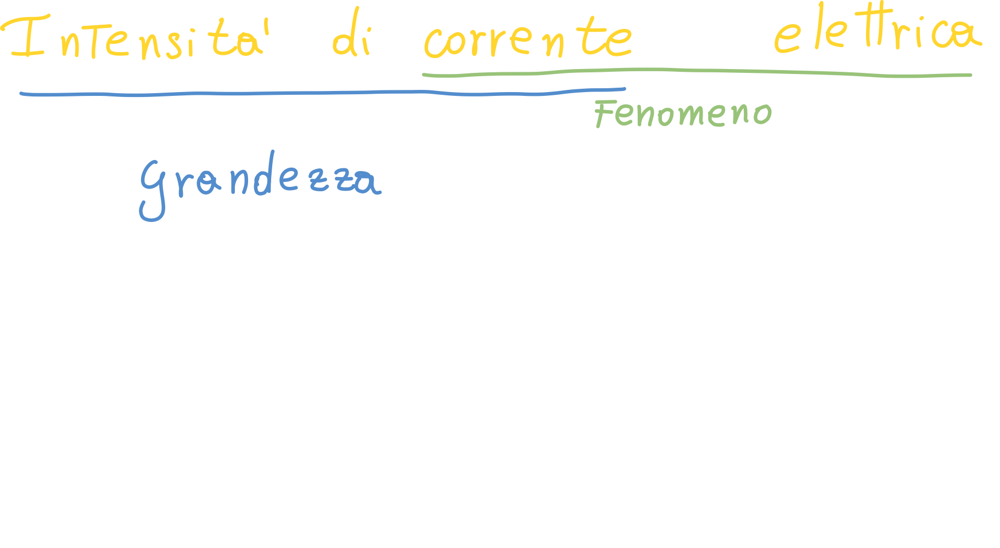
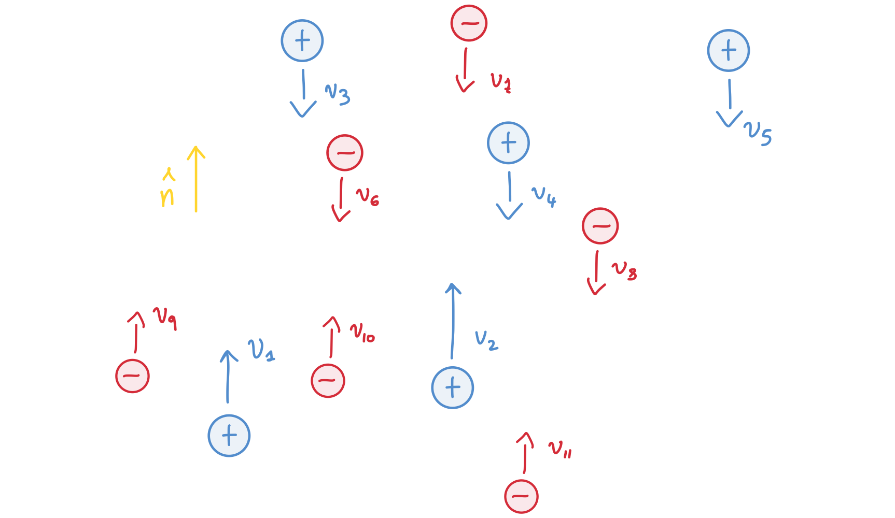
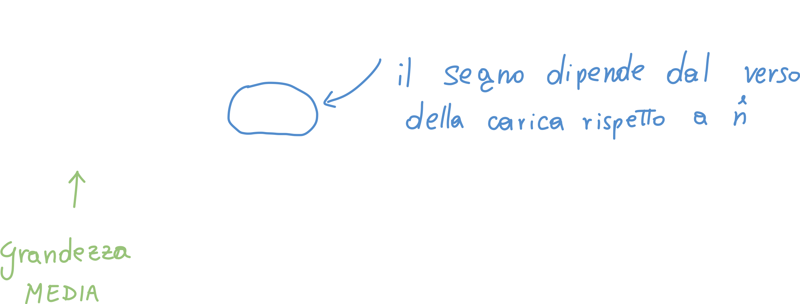
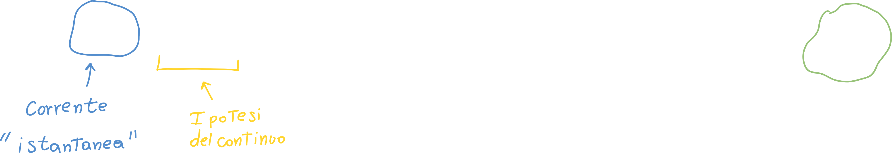
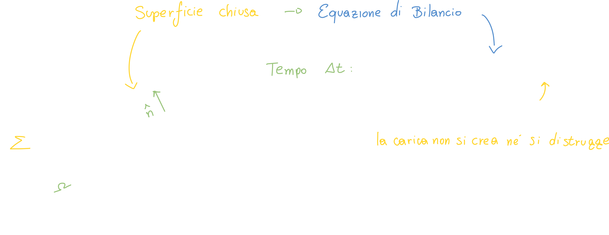
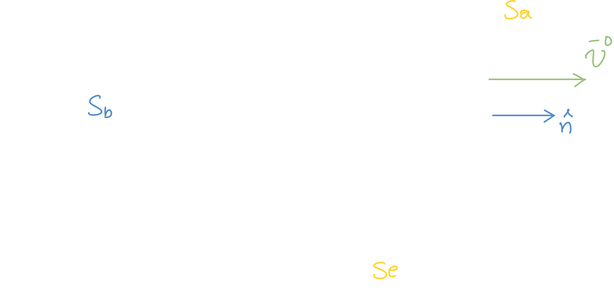
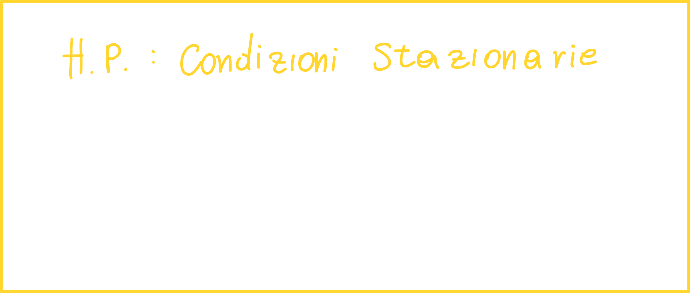

# Lezione 1: Cariche e corrente elettrica

## Recap sugli ordini di grandezza

## Informazione, energia

Per illustrare questo argomento possiamo usare la regola delle 5W:

1. Why?
   Il fine ultimo è comprendere l'informazione e l'energia.
2. Where?
   Usiamo dei **materiali conduttori elettrici**: i cavi. Oltre a questi ci sono anche i **semiconduttori**; questi non sono ne conduttori ne isolanti, e sono importantissimi per l'informatica.
3. What?
   Cosa usiamo per trasformare l'energia e l'informazione?
   Ovviamente usiamo le **cariche elettriche**.
4. When?
   Il tempo è molto legato all'elettrotecnica: esistono circuiti a **regime stazionario, sinusoidale, dinamici, ecc.**
   Un esempio di un valore stazionario è il seguente:
   

L'onda **sinusoidale** è molto importante, perchè questo "va d'accordo" con le macchine: ad esempio, ogni volta che c'è una rivoluzione (pala eolica, motore), il segnale risultante è sinusoidale.

5. Who?
   Il chi è quasi scontato: gli utilizzatori finali siamo noi; siamo noi ad utilizzare l'energia e l'informazione, come meglio crediamo e ci torna utile.

## Trasportare l'energia: La corrente elettrica

L'energia significa lavoro, infatti **compiamo lavoro per trasportare l'informazione**. Quando si parla di "corrente elettrica", si dovrebbe sempre parlare di **intensità di corrente elettrica**;

La **carica elettrica** è quantizzata, e ne abbiamo di due tipi: carica positiva e negativa.

Abbiamo una **superficie**; questa superficie viene **attraversata da delle cariche**, che possono essere positive o negative, ed ogni carica ha la sua velocità; decidiamo inoltre una **normale**; questo vettore ci servirà per "decidere" il verso delle cariche ed attribuire un **segno**:

Possiamo calcolarci la **quantità di carica media** che attraversa la superficie:

Siccome si tratta di una grandezza media, dobbiamo decidere un **intervallo di tempo** su cui effettuare la media (ovviamente più piccolo è, più la misurazione tenderà ad essere "istantanea"):

### Ipotesi del continuo

Se volessimo fare un esempio: nel caso illustrato precedentemente (le cariche quantizzate che attraversano la superficie), **non potremmo calcolare il limite**, perchè parliamo di **cariche singole** che attraversano la superficie.

Essenzialmente, non può mai accadere la situazione in cui ci troviamo ad avere degli istanti di tempo in cui **non passa alcuna carica** ed altri istanti in cui passa un numero di cariche **diverse da zero**; questo equivale ad avere una **funzione discontinua**.

Insomma, *delta_t* deve restare sufficientemente grande in modo da permettere sempre ad almeno una carica di passare attraverso la superficie; ergo: *delta_t* non può tendere a zero (nel caso di cariche quantizzate).

## Intensità di corrente elettrica in un conduttore elettrico filiforme

Se consideriamo una superficie chiusa, il numero di cariche che entra ed esce attraverso la  superficie *sigma* è lo stesso, e di conseguenza **il flusso è zero**.

Anche in questo caso possiamo calcolare la derivata in modo da ottenere:

### A che velocità di muovono le cariche?

A differenza di quello che si può pensare, le cariche **all'interno di un conduttore ohmico** è **molto bassa**, nell'ordine dei <u>centimetri al secondo</u>; quello che invece si muove quasi istantaneamente è l'informazione: il capo elettrico e magnetico.

Anche se la corrente è altissima (nell'ordine dei kiloampere), la velocità delle cariche **non varia**; la velocità delle cariche dipende **unicamente dal mezzo in cui esse si muovono.**

### Cosa succede se la corrente che entra non è uguale a quella che esce?

**Facciamo delle ipotesi:**

- **Ipotesi di condizioni stazionarie**
  In questa ipotesi, qualunque derivata rispetto al tempo ci restituisce **zero**. In queste condizioni, vale il fatto che il numero di cariche che entra è uguale a quello che esce:
  