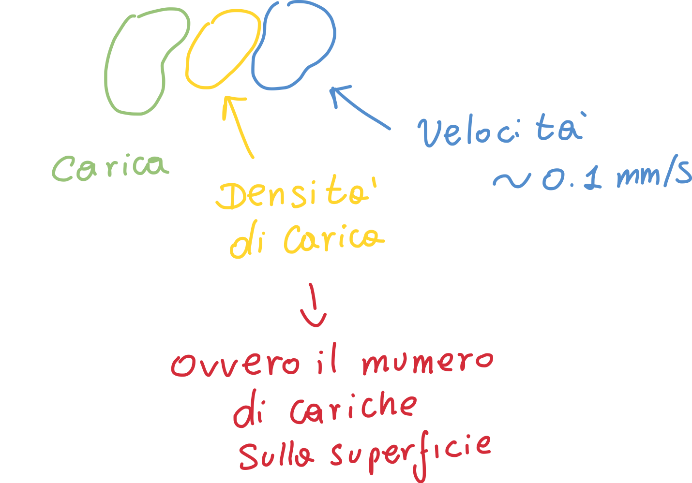
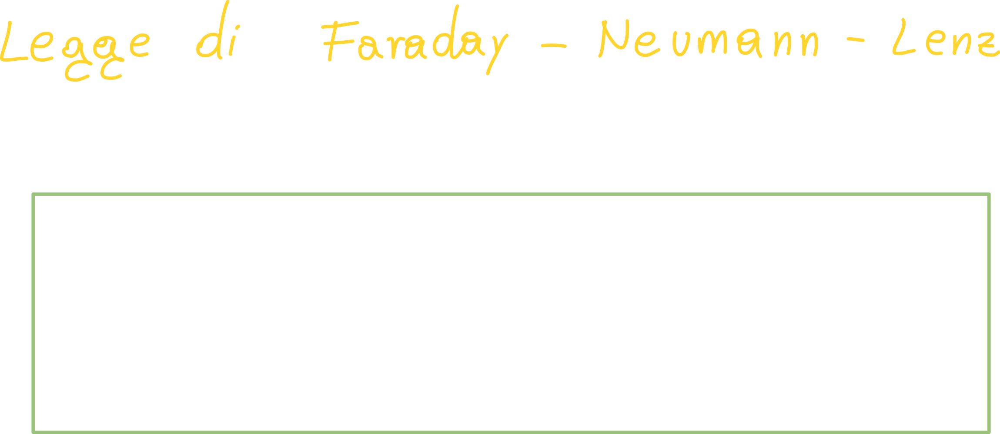
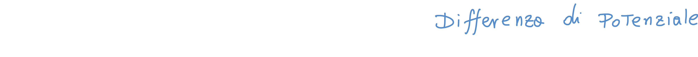

# Lezione 2

Abbiamo visto nella lezione precedente come all'atto pratico le cariche muovendosi attraverso una superficie (ed attraverso un conduttore elettrico) creino una **corrente elettrica**.

Quello che però ci torna utile è **l'utilizzo di funzioni del tempo**, che ci permettono di effettuare calcoli in modo molto più *semplice*.

## Densità di Corrente elettrica

Si dice densità *volumetrica* perchè **le cariche scorrono all'interno dei "volumi"** (come nei cavi elettrici), ed attraversano delle **sezioni**, ovvero **superfici**.

**J** può essere espresso nel seguente modo, ovvero la moltiplicazione della carica, per il numero di cariche sulla superficie (densità superficiale), per la velocità con cui si muovono le cariche nel conduttore (che solitamente è molto bassa):

## Il comportamento dei materiali in relazione alla corrente

L'obbiettivo principale per poter trasmettere l'informazione, è trasportare **energia**; di conseguenza siamo "costretti" a far transitare all'interno di conduttori, o semiconduttori, delle cariche elettriche.

## Differenza di potenziale

Dati due punti *A* e *B* nello spazio, e data una *linea orientata gamma* che unisce A e B, la tensione per andare dal punto A al punto B *lungo gamma*, si definisce **integrale di linea del campo elettrico** da A a B:

Da questa legge (Ampere) si deduce un'importantissima legge, la **legge di Faraday - Neumann - Lenz**:

> La circuitazione del campo elettrico lungo una **linea chiusa *gamma*** è uguale al flusso dell'induzione magnetica (negativa -> Legge di Lenz) concatenato con una qualsiasi superficie che è attraversata dal campo magnetico B.
>
> In altre parole, una variazione del campo magnetico nel tempo, produce una differenza di potenziale/forza elettromotrice/tensione.

Inoltre, se percorriamo *gamma* al "contrario", ovvero da B ad A, solitamente la differenza tra i due potenziali non è zero, bensì proprio la derivata del flusso del campo magnetico cambiata di segno:

Se invece siamo in **condizioni stazionarie**, ovvero la derivata delle grandezze in gioco sono sempre zero, parleremo di **differenza di potenziale**; in questo caso, il potenziale **non dipende più dal percorso scelto**:

In questo caso si dice che **il campo è conservativo**, ovvero la **circuitazione del campo elettrico è zero**; un altro campo conservativo può essere il **campo gravitazionale**.