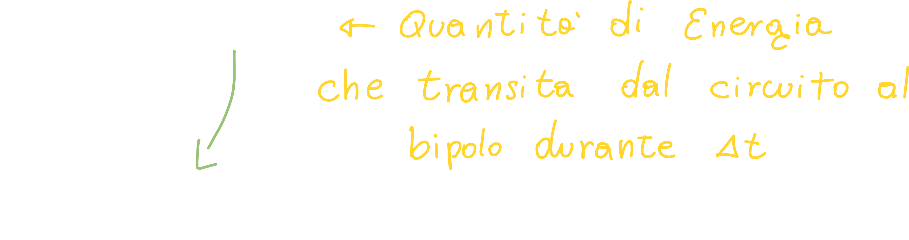
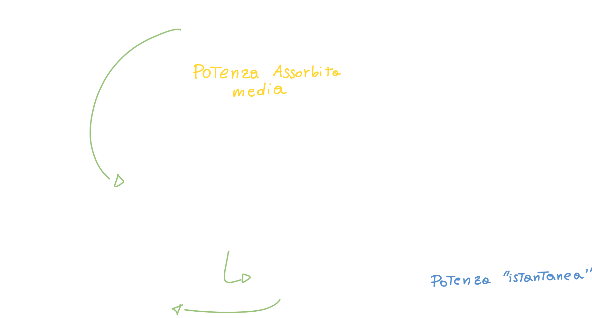

# Il bipolo elettrico

Abbiamo visto nella lezione precedente come all'atto pratico le cariche muovendosi attraverso una superficie (ed attraverso un conduttore elettrico) creino una **corrente elettrica**.

Quello che però ci torna utile è **l'utilizzo di funzioni del tempo**, che ci permettono di effettuare calcoli in modo molto più *semplice*.

[TOC]

## Densità di Corrente elettrica

Si dice densità *volumetrica* perchè **le cariche scorrono all'interno dei "volumi"** (come nei cavi elettrici), ed attraversano delle **sezioni**, ovvero **superfici**.

**J** può essere espresso nel seguente modo, ovvero la moltiplicazione della carica, per il numero di cariche sulla superficie (densità superficiale), per la velocità con cui si muovono le cariche nel conduttore (che solitamente è molto bassa):

## Il comportamento dei materiali in relazione alla corrente

L'obbiettivo principale per poter trasmettere l'informazione, è trasportare **energia**; di conseguenza siamo "costretti" a far transitare all'interno di conduttori, o semiconduttori, delle cariche elettriche.

## Differenza di potenziale

Dati due punti *A* e *B* nello spazio, e data una *linea orientata gamma* che unisce A e B, la tensione per andare dal punto A al punto B *lungo gamma*, si definisce **integrale di linea del campo elettrico** da A a B:

Da questa legge (Ampere) si deduce un'importantissima legge, la **legge di Faraday - Neumann - Lenz**:

> La circuitazione del campo elettrico lungo una **linea chiusa *gamma*** è uguale al flusso dell'induzione magnetica (negativa -> Legge di Lenz) concatenato con una qualsiasi superficie che è attraversata dal campo magnetico B.
>
> In altre parole, una variazione del campo magnetico nel tempo, produce una differenza di potenziale/forza elettromotrice/tensione.

Inoltre, se percorriamo *gamma* al "contrario", ovvero da B ad A, solitamente la differenza tra i due potenziali non è zero, bensì proprio la derivata del flusso del campo magnetico cambiata di segno:

Se invece siamo in **condizioni stazionarie**, ovvero la derivata delle grandezze in gioco sono sempre zero, parleremo di **differenza di potenziale**; in questo caso, il potenziale **non dipende più dal percorso scelto**:

In questo caso si dice che **il campo è conservativo**, ovvero la **circuitazione del campo elettrico è zero**; un altro campo conservativo può essere il **campo gravitazionale**.

## Il bipolo elettrico

Il bipolo elettrico è "l'elemento base" che **popola tutti i nostri circuiti**; esso ha **due terminali/morsetti/collegamenti**, che nella figura abbiamo chiamato *A e B*:

.png)

*"omega"* rappresenta proprio **l'involucro o black box** del nostro componente elettronico, come potrebbe essere un **alimentatore per telefono**. **L'interazione** con l'oggetto avviene solo ed unicamente attraverso questi due terminali; infatti possiamo toccare tranquillamente il nostro alimentatore senza correre il rischio di venire a contatto con una corrente elettrica.

I componenti elettronici nella realtà sono molto complicati; infatti per comprenderli al meglio dovremmo adoperare le **equazioni di Maxwell** complete, con campi elettrici e magnetici variabili.

Quello che invece vogliamo fare in questo corso è **semplificare** quanto più possibile, in modo da ragionare unicamente con **tensione** (differenza di potenziale) e **corrente**.

Tornando al bipolo: al suo interno può esserci un qualsiasi componente (o più componenti) elettronico, come ad esempio un resistore; quello che ci interessa è il fatto che l'interazione avviene sempre e solo attraverso i morsetti.

Se prendo una **superficie chiusa S** che *avvolge* il bipolo (non toccando l'involucro *omega*!) ed attraversa **solo i morsetti A e B**:

.png)

Possiamo a questo punto applicare la **conservazione della carica**; ci accorgiamo che l'unico contributo diverso da zero è la corrente che fluisce **attraverso i morsetti**:

### Prima condizione affinché si possa parlare di bipolo elettrico

A questo punto **facciamo un'approssimazione**: consideriamo tutti i casi in cui il modulo delle cariche rispetto al tempo è molto minore del modulo delle correnti che fluiscono attraverso i morsetti:

Se facciamo valere la nostra ipotesi, allora possiamo approssimare la derivata delle cariche attraverso omega a zero, e quindi possiamo dire che **la corrente che entra è pari a quella che esce**.

### Seconda condizione affinché si possa parlare di bipolo elettrico

Questa seconda condizione **riguarda le differenze di potenziale:**

Data una linea orientata *gamma* che va da A a B, ed una seconda linea orientata *gamma_primo* che va da A a B, possiamo calcolare la differenza di potenziale tramite la **legge di Faraday-Neumann-Lenz**:

Possiamo fare una seconda ipotesi, e dire che **la derivata del flusso del campo magnetico <u>in modulo</u>** è *molto minore* del modulo dei due potenziali; diciamo "in modulo" perchè non abbiamo detto che la derivata non può variare, anzi; la derivata varia, ma assume valori sia positivi che negativi; facendo questo diciamo che "in modulo" è quasi pari a zero, o molto più piccola dei potenziali:

> Si intende per "ragionevole" una qualsiasi linea che collega un morsetto all'altro avente "all'incirca" la stessa lunghezza del nostro componente elettronico.
>
> Una linea "irragionevole" può essere una linea "attorcigliata" su se stessa, estremamente più lunga del nostro componente elettronico. Questo perchè la superficie diventa molto grande, ed anche se il campo B è piccolo, il flusso viene amplificato grazie alla grande superficie.

Anche in questo caso si parla di **ipotesi di quasi stazionarietà**.

Il **succo del discorso** è che **qualsiasi linea ragionevole** andremo a scegliere, questa ci darà **sempre la stessa differenza di potenziale** tra A e B.

### Recap bipolo elettrico

> **Definizione**: Il bipolo elettrico è un oggetto che interagisce con il resto del circuito elettrico solo attraverso i suoi due morsetti; è caratterizzato da una sola corrente (i_A = -i_B) e da una sola differenza di potenziale V_AB.

1. Il bipolo elettrico deve avere un involucro; questo involucro non deve avere contatti con l'esterno; solo i due morsetti hanno contatti con l'esterno.
2. La condizione di **quasi stazionarietà** ci garantisce che la corrente in un morsetto è **all'incirca** uguale a quella che esce.
3. Considero la derivata del flusso del campo magnetico molto più piccola dei potenziali. Anche in questo caso si parla di **ipotesi di quasi stazionarietà** e le due linee *gamma* e *gamma_primo* devono essere **ragionevoli.**

## Potenze ed energie assorbite da un bipolo elettrico

Affinché le cariche possano spostarsi da un polo all'altro, ci deve essere una "spesa di energia", e di conseguenza si deve **compiere un lavoro**.

Quando schematizziamo il bipolo, poniamo il **+** ed il **-**; ma questi simboli **non ci dicono dove sono le cariche positive e negative**, ma invece servono solo per **riferimento della tensione**; quando ad esempio diciamo "*v(t) è a 10 Volt*", stiamo dicendo che **il morsetto A ha un potenziale maggiore rispetto a B**.

Immaginiamo di avere un intervallo di tempo *delta_t* in cui andiamo a misurare *delta_We*:

Se *delta_We* è positiva, il bipolo **sta assorbendo energia** dal circuito, oppure, in maniera equivalente, **il circuito sta erogando energia**.

Se facciamo il rapporto tra la potenza assorbita, ed un intervallo di tempo, otteniamo la **potenza assorbita nell'intervallo** *delta_t*, oppure **potenza assorbita media**:

> **N.B.** questo concetto è un **concetto generale**: possiamo usarlo per le **grandezze elettriche**, ma anche con altre grandezze. Possiamo considerare infatti un sistema meccanico, in cui abbiamo una ruota che viene messa in rotazione da un altro sistema, e comunque avremmo avuto un **flusso di energia** da un sistema all'altro, e quindi avremmo avuto una "potenza".
>
> Inoltre non diciamo "potenza elettrica", perché ogni potenza viene calcolata allo stesso modo.

Si può dimostrare che:

> <<La potenza istantanea assorbita dal dipolo  è proprio il prodotto della tensione per la corrente, con il verso scelto.>>

Questo ha senso, perchè basti pensare al fato che il potenziale rappresenta *l'unità di carica per il lavoro*, mentre la corrente rappresenta il *numero di cariche in unità di tempo*; di conseguenza il loro prodotto rappresenta *un lavoro nell'unità di tempo*, ovvero la potenza.

