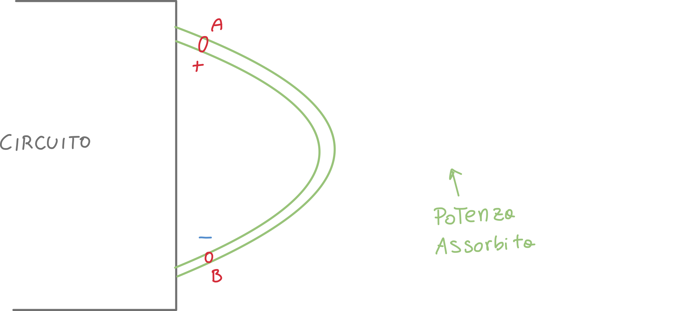
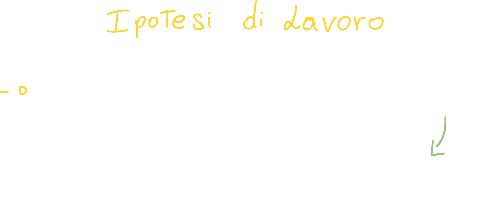
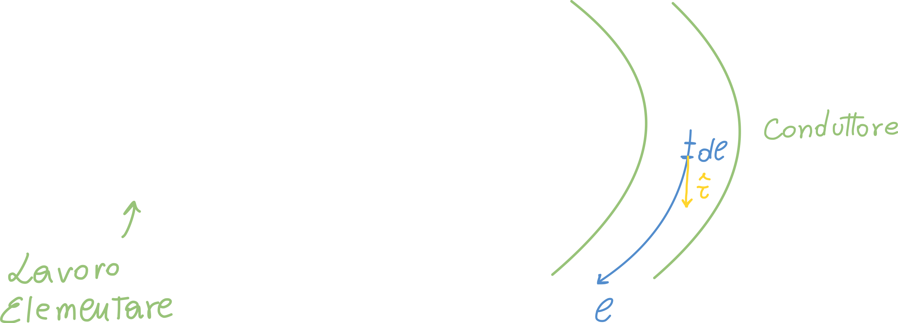
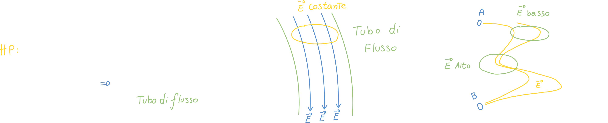
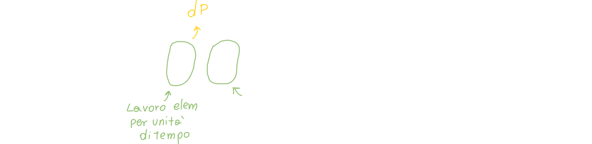
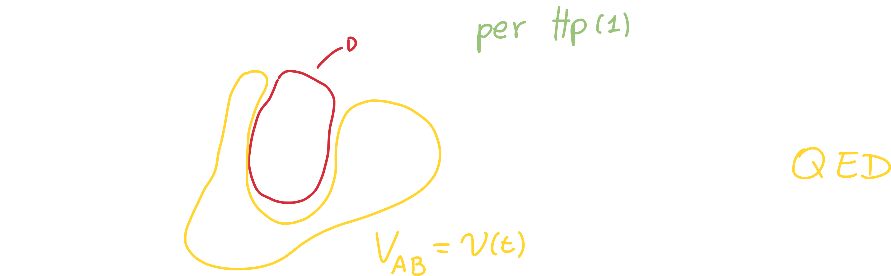
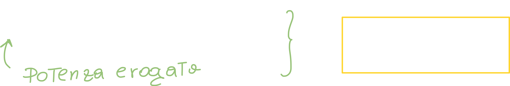
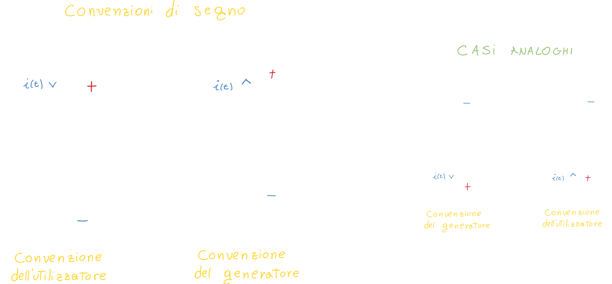

# Potenza assorbita ed erogata da un bipolo conduttore ohmico filiforme

Per *conduttore ohmico filiforme* si intende un qualsiasi conduttore avente una sezione circolare; di conseguenza **la densità di corrente è proporzionale al campo elettrico** (la legge di ohm funziona).

Ovviamente ci aspettiamo che **la potenza assorbita sia maggiore di zero**; questo non è però scontato: se invece di un conduttore ohmico (come un filo, o resistore) avessimo un *generatore* (come una batteria), questa potrebbe anche *erogare energia*, e quindi non la assorbirebbe dal circuito.

Vogliamo quindi **dimostrare** che la potenza assorbita dal dipolo è *v(t) \* i(t)*: 

## Dimostrazione potenza assorbita: Ipotesi del lavoro

Questa ipotesi ci dice che *prendendo il potenziale maggiore o minore di zero non cambia la dimostrazione*:

Ovviamente le cariche si muovono dal punto con il *potenziale maggiore*, al punto col potenziale minore; in questo caso si spostano da A a B.

Immaginiamo di considerare la carica elementare dq che si muove (con la usa velocità *v*) attraverso la sezione del filo; quale sarà il lavoro elementare che si deve compiere per spostare una carica dq?

A questo punto facciamo un'altra ipotesi: ci poniamo nel caso in cui il conduttore è molto più lungo della sua sezione (proprio come un lungo filo conduttore); questo ci permette di affermare che **le linee del campo elettrico sono parallele alle "pareti" del conduttore**:

Questo vuol dire che per qualsiasi punto la **densità delle linee di forza di E** è sempre la stessa; questo si traduce nel fatto che **l'intensità di E è costante per tutta la lunghezza del conduttore**.

Tornando al lavoro, possiamo calcolare il lavoro per unità di tempo, che non è altro che una **potenza elementare**. Per trovare la *potenza totale*, ci basta integrare **lungo gamma**:

Ma come abbiamo detto in precedenza, l'integrale lungo la linea *gamma* che va da A a B non è altro che il potenziale VAB:

### Dimostrazione con ipotesi di lavoro alternativa

Questa volta la nostra ipotesi del lavoro è la seguente:

- Il potenziale V0 è negativo
- La corrente *i(t)* è **negativa** perché la velocità della carica ***v*** è **opposta a *dl***.
  (la velocità ha verso opposto perché abbiamo cambiato il valore del potenziale; le cariche vanno dal potenziale maggiore a quello minore.)

Di conseguenza, andando a moltiplicare, **la potenza assorbita è sempre maggiore di zero**!

Per questo motivo, soprannominiamo Pe= *v(t) \* i(t)* **POTENZA EROGATA**:

Per **costruzione** una potenza ha una grandezza con segno invertito rispetto all'altra.

# Convenzioni di segno per tensioni e correnti

Come prima cosa, da questo momento non rappresenteremo più il dipolo come una "patata" (tondeggiante), ma con il seguente schema:

## Convenzione dell'utilizzatore

Il prodotto v*i, se maggiore di zero, rappresenta effettivamente una potenza assorbita dal dipolo, ovvero un flusso di energia nell'unità di tempo, che dal circuito fluisce verso il dipolo.

## Convenzione del generatore

Se la corrente elettrica i(t) **ha verso opposto**, ovvero da B ad A, la potenza è detta (come abbiamo appena visto) *potenza erogata*; e di conseguenza è detta **convenzione del generatore**.

# Premessa sui circuiti elettrici

Esempi di dipoli elettrici sono:

- Resistore
- Condensatori
  - Elettrolitici
  - Ceramici
- Componenti SMT: 
  *sono dispositivi elettronici compatti saldati sulla superficie di schede di circuiti, consentendo maggiore densità e efficienza nella produzione di dispositivi avanzati.*
- Induttori
- Diodi

Esistono poi i **tri-poli** elettrici:

- Transistori: possono aumentare l'ampiezza di un segnale
- Mosfet

Successivamente ci sono i **circuiti integrati**, ovvero componenti elettronici in cui sono presenti ulteriori componenti elettronici, come resistori, transistori, ecc. Hanno solitamente più pin: 8/16/32...

Abbiamo successivamente i **processori**, detti **n-poli**, che hanno anche centinaia di pin. All'interno dei processori abbiamo un elevatissimo numero di componenti; ci sono delle aree dette **Porte CMOS**, che è una tecnologia utilizzata per "stampare" i circuiti.

I circuiti stampati solitamente **hanno più piani**, anche se in questo corso vedremo circuiti stampati su un singolo piano. Ad esempio il Mosfet è strutturato su 3 "piani".

