# Esempi di Dipoli: Il resistore ed il generatore ideale

[TOC]

## Il resistore

Se abbiamo una **corrente**, ma abbiamo bisogno che essa diventi una **tensione** possiamo usare un resistore:

### Prima legge di Ohm

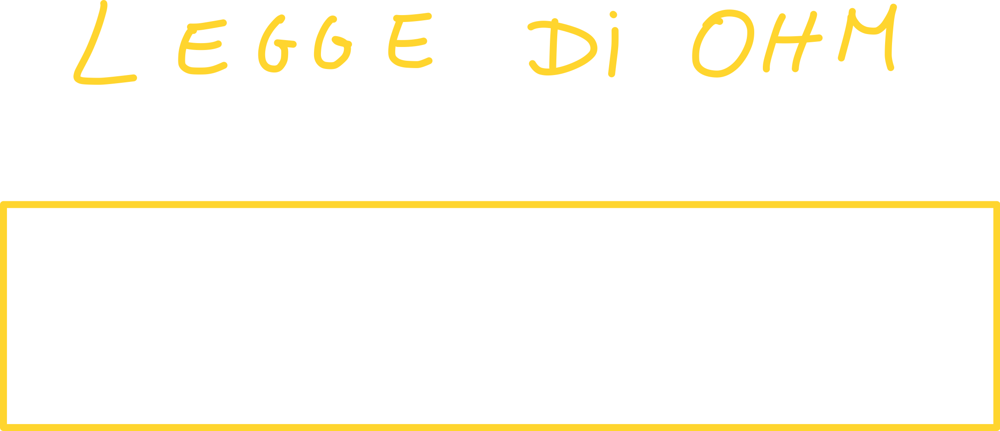

> N.B. Questa legge è scritta in relazione alla **convenzione dell'utilizzatore** (vedi lezione 3).

Come sappiamo dal corso di fisica, la realtà dei fatti non è così semplice come questa relazione spera di farci credere; in realtà ci sono molte più variabili in gioco, come ad esempio la temperatura: infatti solitamente la *resistività* aumenta all'aumentare della temperatura.

D'ora in poi, per ogni **dipolo** che andiamo ad introdurre, scriveremo **l'equazione caratteristica** (che in questo caso è proprio la legge di Ohm); dobbiamo anche stabilire una **convenzione**: in questo caso usiamo la **convenzione dell'utilizzatore**, vista nella lezione precedente.

Ogni conduttore ha la sua **conducibilità** elettrica, che ci dice **quanto quel materiale conduce corrente**:

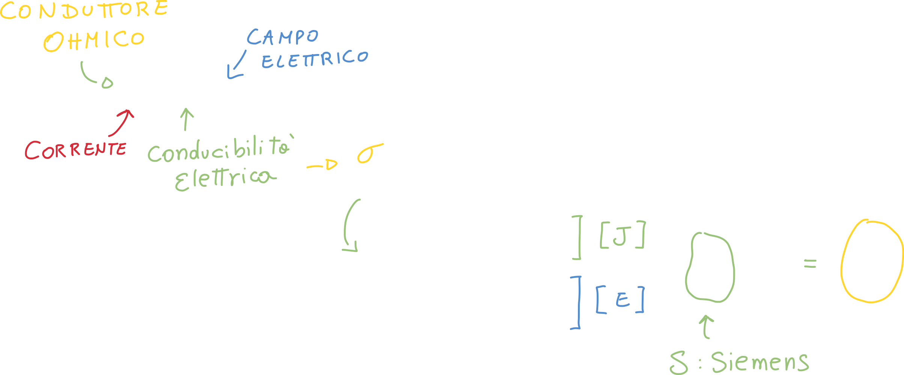

Ma in questo corso (e nella maggior parte delle volte) considereremo i **circuiti che collegano i dipoli** a **resistenza nulla**.

Anche in questo caso ci poniamo nell'ipotesi "**tubo di flusso**" in cui la lunghezza del conduttore è molto maggiore della sezione:

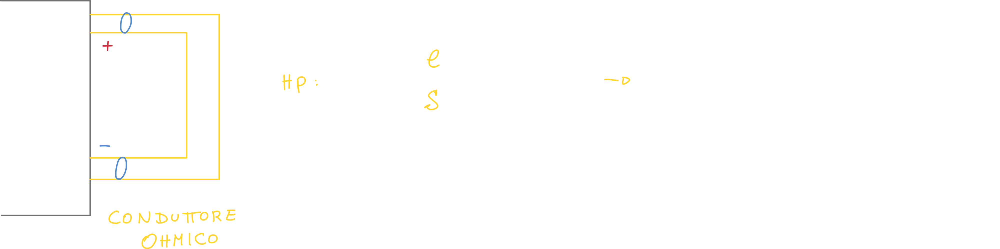

Questa ipotesi ci permette di essere sicuri che le linee del campo elettrico sono **parallele** alla velocità delle cariche, e quindi:

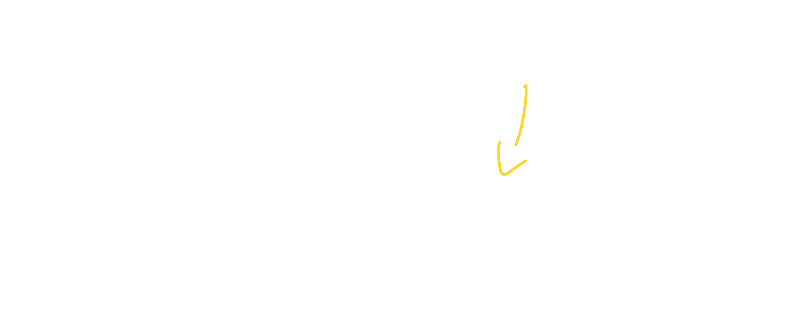

Possiamo trovare la **seconda legge di Ohm nel seguente modo:**

### Seconda legge di Ohm

Ricordandoci che **J** è legato al campo elettrico tramite sigma: *J=sigma\*E*

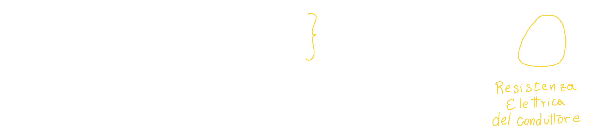

Possiamo quindi scrivere:

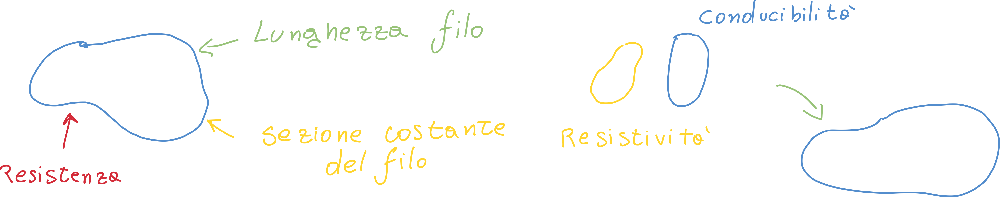

Bisogna notare che la **conducibilità** è il contrario della **resistività**; possiamo quindi esprimere la **resistenza** in due modi (molto simili tra loro).

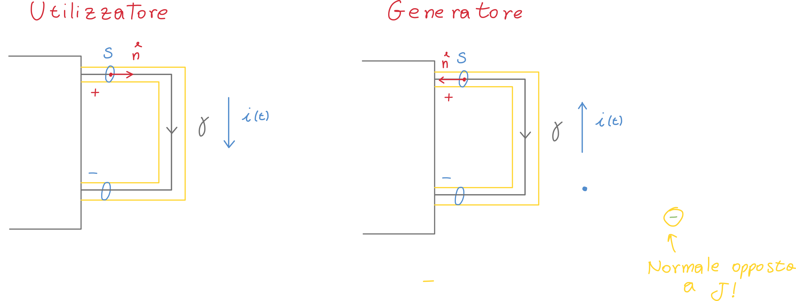

### Conduttanza

La conduttanza è l'inverso della **conducibilità**; allo stesso modo la **induttanza** è l'inverso della **resistività**:

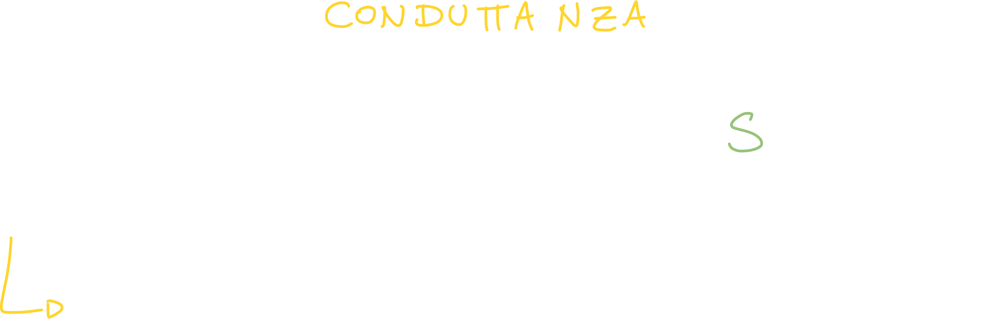

## Bipolo Cortocircuito ideale e Piano tensione corrente

Definiamo "cortocircuito" un dipolo avente **resistenza nulla**:

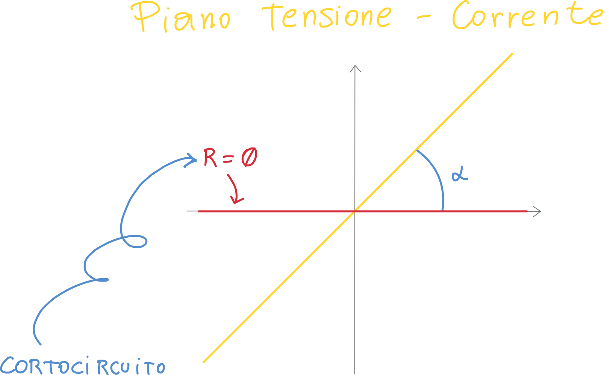

La caratteristica del cortocircuito è che ha una **differenza di potenziale nulla**, per una qualsiasi corrente.

Il contrario della resistenza nulla, è proprio la **conduttanza nulla**, che ci indica che il materiale "non conduce per nulla" (non esistono gli assoluti!); in questo caso si dice **bipolo circuito aperto**:

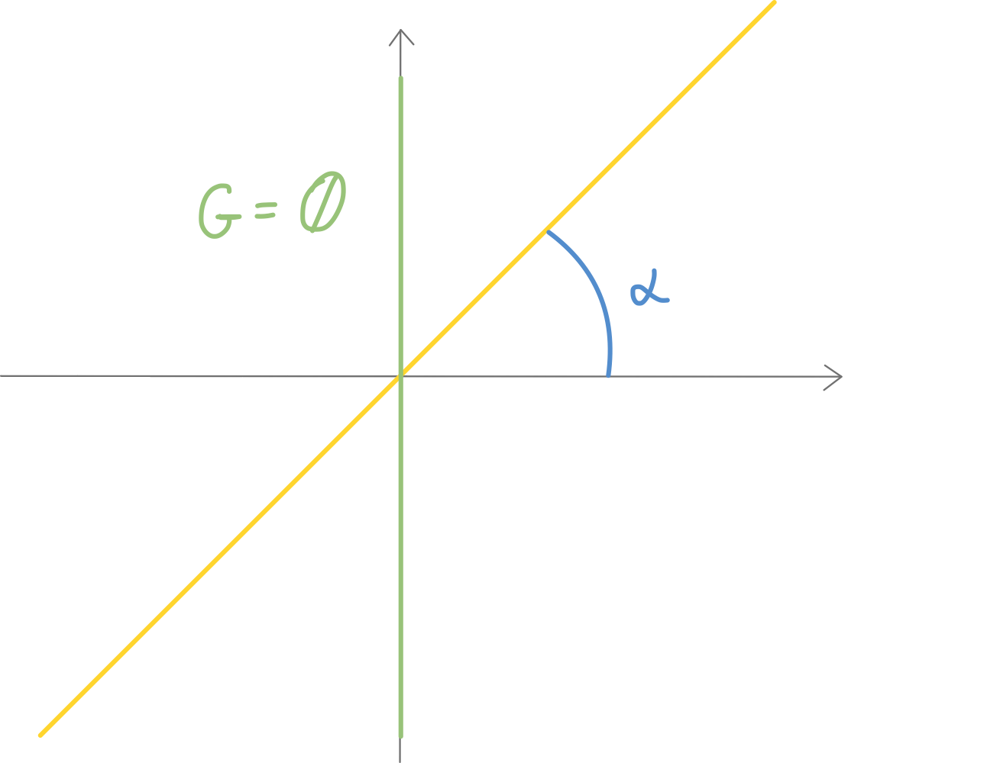

## I simboli dei dipoli appena visti

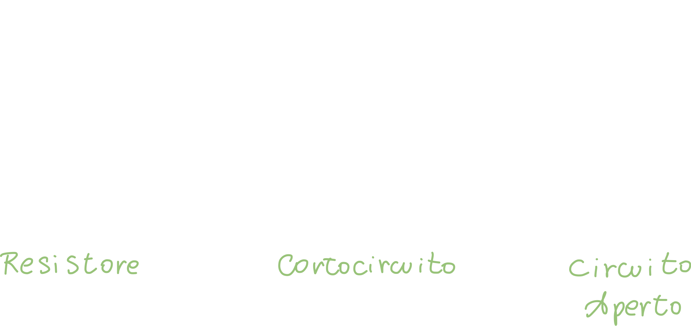

## Bipolo generatore Ideale di tensione e di corrente

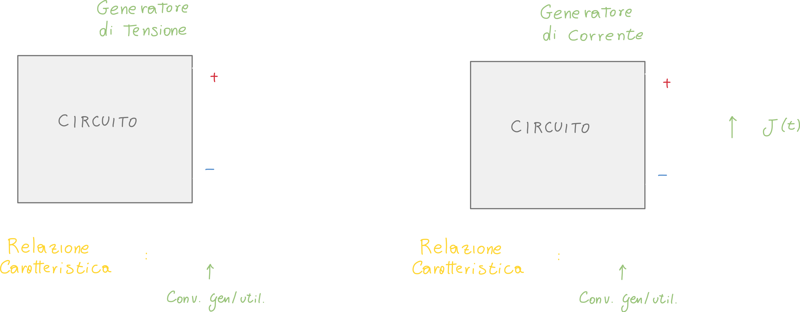

- *e(t)* è una **funzione matematica del tempo**; non deve essere per forza variabile, infatti (per semplificare), vediamo e(t) come una **costante**.
  Un generatore di tensione può essere una **batteria**, quindi il numero e(t) può benissimo essere il voltaggio di una pila AA.
- j(t) è anch'essa una funzione matematica del tempo, che può essere sia variabile che costante; il generatore di corrente non esiste vero e proprio: va sintetizzato.
  Per creare un generatore di corrente devono essere "messi insieme" tanti dipoli; un esempio è il **pannello fotovoltaico**, che a volte si comporta da generatore di tensione, altre volte da generatore di corrente.

Per ogni dipolo che vedremo, andremo ad esaminare 4 aspetti fondamentali:

- Tensione
- Corrente
- Potenza
- Energia

Questo ci fa capire che per il resistore ci manca ancora **potenza** ed **energia**.

# Raccolta di esercizi

## Esercizio 1

Scrivere le leggi di kirchhoff per il seguente circuito

## Esercizio 2

Determinare tensioni e correnti per il seguente circuito