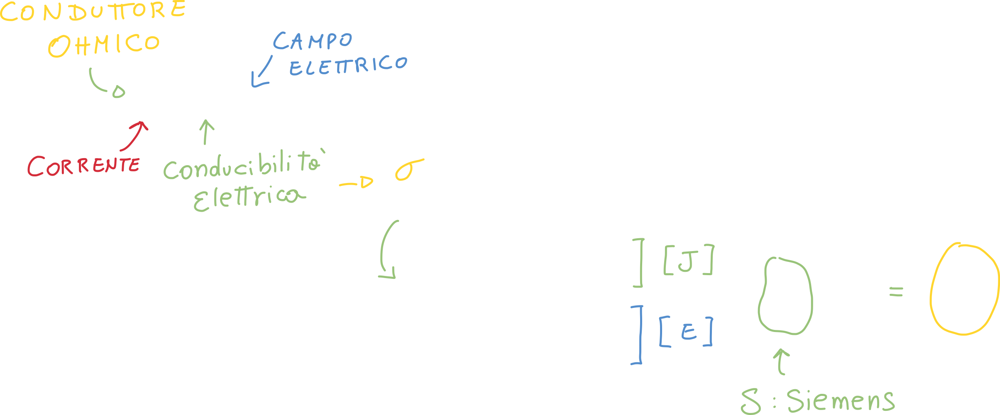

# Esempi di Dipoli: Il resistore ed il generatore ideale

[TOC]

## Il resistore

Se abbiamo una **corrente**, ma abbiamo bisogno che essa diventi una **tensione** possiamo usare un resistore:

Come sappiamo dal corso di fisica, la realtà dei fatti non è così semplice come questa relazione spera di farci credere; in realtà ci sono molte più variabili in gioco, come ad esempio la temperatura: infatti solitamente la *resistività* aumenta all'aumentare della temperatura.

D'ora in poi, per ogni **dipolo** che andiamo ad introdurre, scriveremo **l'equazione caratteristica** (che in questo caso è proprio la legge di Ohm); dobbiamo anche stabilire una **convenzione**: in questo caso usiamo la **convenzione dell'utilizzatore**, vista nella lezione precedente.

Ogni conduttore ha la sua **conducibilità** elettrica, che ci dice **quanto quel materiale conduce corrente**:

Ma in questo corso (e nella maggior parte delle volte) considereremo i **circuiti che collegano i dipoli** a **resistenza nulla**.