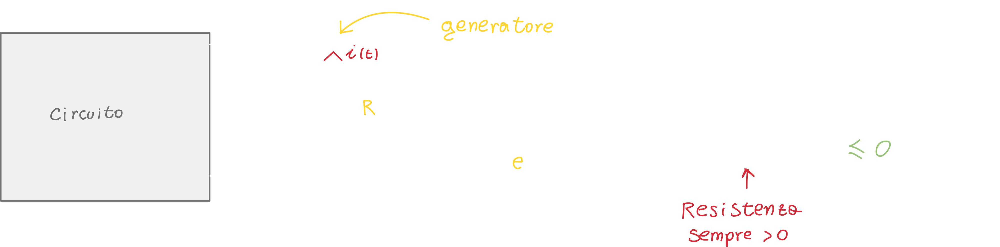

# Potenza ed energia assorbite da un resistore

## Potenza assorbita ed erogata

Per capire la potenza ed energia assorbite da un resistore dobbiamo analizzare come al solito un circuito che include il bipolo resistore; andiamo quindi ad applicare le solite convenzioni, adottando la convenzione dell'utilizzatore:

Quando il prodotto è **maggiore di zero** vuol dire che il nostro resistore sta **assorbendo** energia dal circuito.

Allo stesso modo, la **potenza erogata** (ovvero potenza assorbita!) **dal resistore è sempre minore di zero**:

Possiamo anche ricavare la corrente (dalla legge di ohm) e sostituirla nell'equazione della potenza assorbita/erogata:

