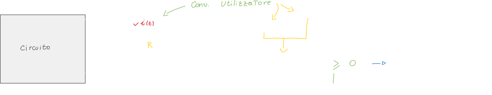
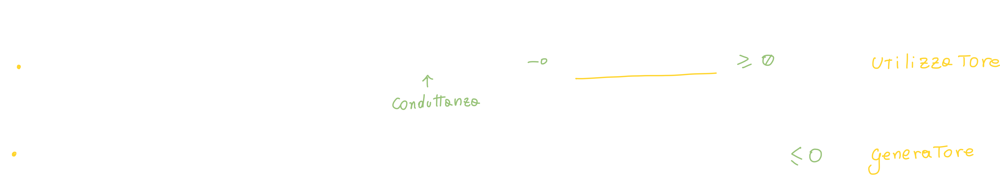
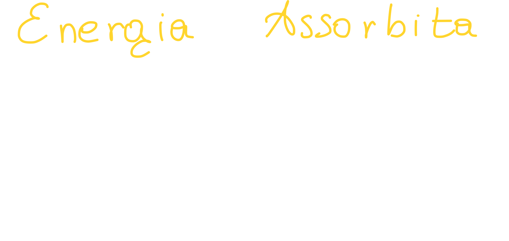
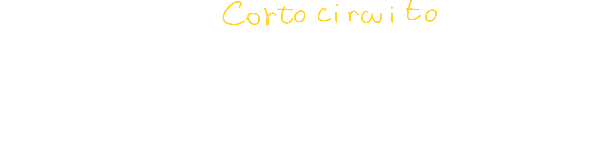

# Potenza ed energia assorbite da un resistore

## Potenza assorbita ed erogata

Per capire la potenza ed energia assorbite da un resistore dobbiamo analizzare come al solito un circuito che include il bipolo resistore; andiamo quindi ad applicare le solite convenzioni, adottando la convenzione dell'utilizzatore:

Quando il prodotto è **maggiore di zero** vuol dire che il nostro resistore sta **assorbendo** energia dal circuito.

Allo stesso modo, la **potenza erogata** (ovvero potenza assorbita!) **dal resistore è sempre minore di zero**:

Possiamo anche ricavare la corrente (dalla legge di ohm) e sostituirla nell'equazione della potenza assorbita/erogata:

## Energia assorbita

Per calcolare l'energia assorbita (in generale) ci basta **integrare la potenza nell'intervallo di tempo**:

Nel nostro caso specifico ci basta sostituire a Pa(t):

## Potenza ed energia del dipolo cortocircuito

## Potenza ed energia del dipolo circuito aperto

# Concetto di Bipolo a-dinamico

## Bipolo a-dinamico Passivo

Dal punto di vista energetico, un bipolo adinamico (ovvero con caratteristica algebrica o istantanea) si dice **passivo** se la potenza assorbita è sempre maggiore o uguale a zero.

Inoltre, si dice **strettamente passivo** quando assorbe potenza maggiore, e la potenza assorbita è nulla solo se *tensione per corrente* sono <u>entrambi zero</u>.

Riassumendo:

- Il resistore con R>0 è **strettamente passivo.**
- Il cortocircuito ed il circuito aperto sono bipoli **non strettamente passivi**.

 Per spiegare il concetto, esaminiamo il piano cartesiano:

- **Primo quadrante:** il prodotto v*i è **sempre maggiore di zero** ovvero nei **punti di funzionamento** (pallini in verde, ovvero punti appartenenti all'equazione caratteristica del dipolo) del primo quadrante.
  In questo quadrante **la potenza assorbita è maggiore di zero**.
- **Terzo quadrante:**  anche in questo caso la potenza assorbita è maggiore di zero.
- **Secondo e Quarto quadrante**: In questi quadranti non **<u>deve</u>** essere presente alcun punto!
  Infatti <u>l'unico punto</u> in cui l'equazione caratteristica del resistore dovrebbe essere zero, è proprio in zero!

# Bipolo Generatore reale di tensione

Anche il circuito è un bipolo; a questo circuito è connesso un altro bipolo: il generatore **reale** di tensione:

Il **generatore reale di tensione** è costituito da **due elementi che abbiamo giù visto**:

1. Generatore ideale di tensione
2. Resistore

Come faremo con ogni dipolo, dobbiamo andare ad analizzarlo: la prima cosa che facciamo è stabilire una convenzione, in questo caso adottiamo quella del **generatore**: andiamo quindi a riportare differenza di potenziale e verso della corrente:

Per **ricavare l'equazione caratteristica** abbiamo diversi strumenti a nostra disposizione: **le leggi di Kirchhoff e le caratteristiche dei singoli bipoli.**

