# Potenza ed energia assorbite da un resistore

[TOC]

## Potenza assorbita ed erogata

Per capire la potenza ed energia assorbite da un resistore dobbiamo analizzare come al solito un circuito che include il bipolo resistore; andiamo quindi ad applicare le solite convenzioni, adottando la convenzione dell'utilizzatore:

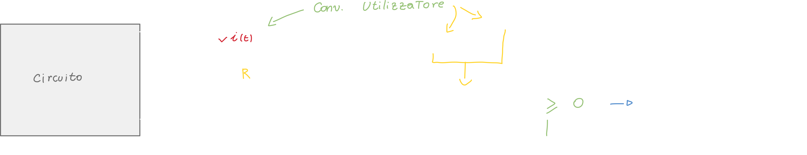

Quando il prodotto è **maggiore di zero** vuol dire che il nostro resistore sta **assorbendo** energia dal circuito.

Allo stesso modo, la **potenza erogata** (ovvero potenza assorbita!) **dal resistore è sempre minore di zero**:

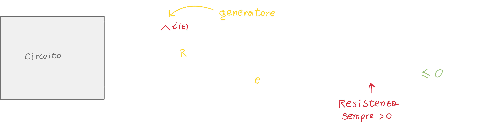

Possiamo anche ricavare la corrente (dalla legge di ohm) e sostituirla nell'equazione della potenza assorbita/erogata:

## Energia assorbita

Per calcolare l'energia assorbita (in generale) ci basta **integrare la potenza nell'intervallo di tempo**:

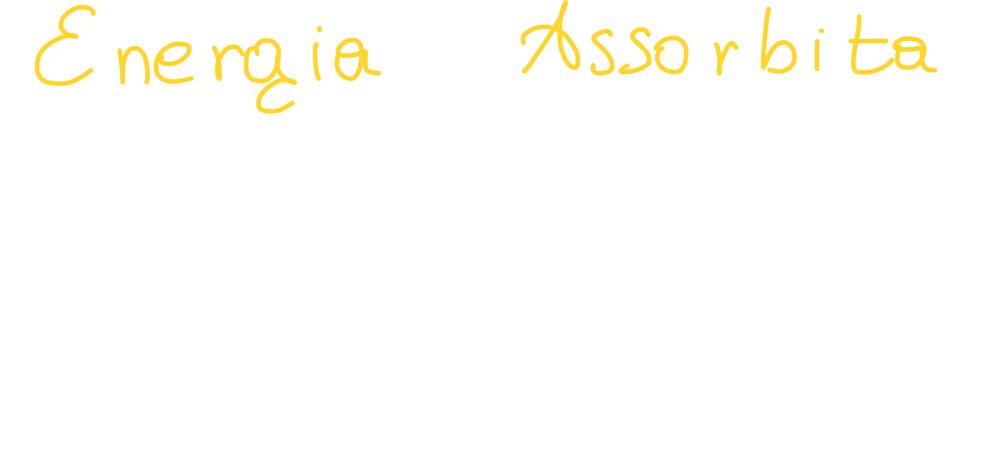

Nel nostro caso specifico ci basta sostituire a Pa(t):

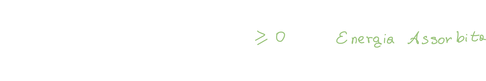

## Potenza ed energia del dipolo cortocircuito

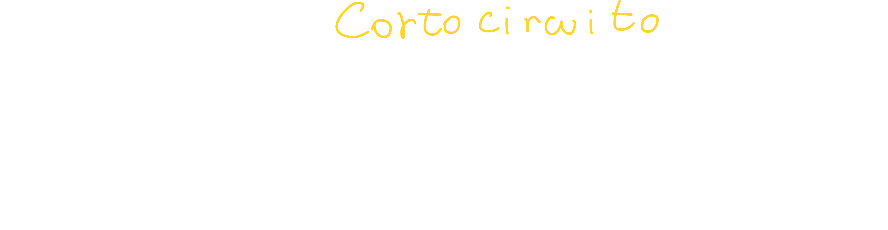

## Potenza ed energia del dipolo circuito aperto

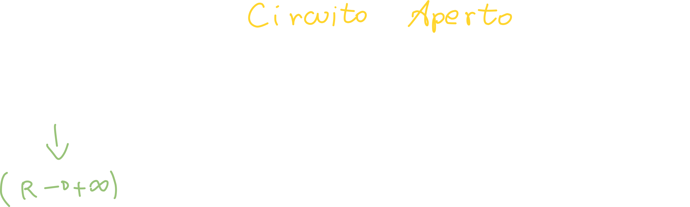

# Concetto di Bipolo a-dinamico

## Bipolo a-dinamico Passivo

Dal punto di vista energetico, un bipolo adinamico (ovvero con caratteristica algebrica o istantanea) si dice **passivo** se la potenza assorbita è sempre maggiore o uguale a zero.

Inoltre, si dice **strettamente passivo** quando assorbe potenza maggiore, e la potenza assorbita è nulla solo se *tensione per corrente* sono <u>entrambi zero</u>.

Riassumendo:

- Il resistore con R>0 è **strettamente passivo.**
- Il cortocircuito ed il circuito aperto sono bipoli **non strettamente passivi**.

 Per spiegare il concetto, esaminiamo il piano cartesiano:

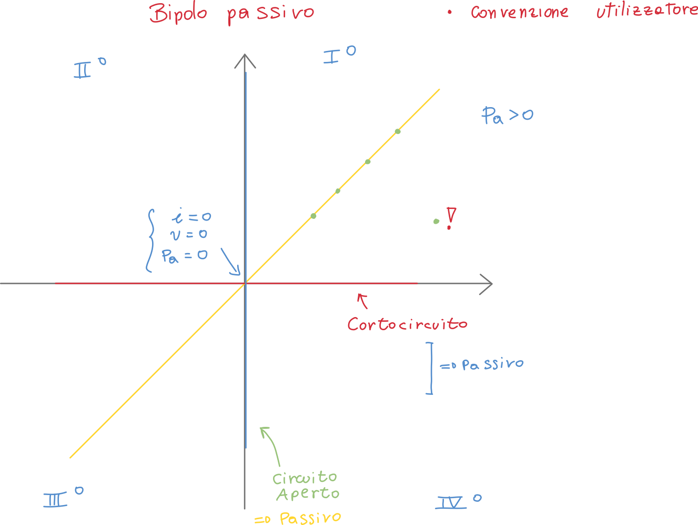

- **Primo quadrante:** il prodotto v*i è **sempre maggiore di zero** ovvero nei **punti di funzionamento** (pallini in verde, ovvero punti appartenenti all'equazione caratteristica del dipolo) del primo quadrante.
  In questo quadrante **la potenza assorbita è maggiore di zero**.
- **Terzo quadrante:**  anche in questo caso la potenza assorbita è maggiore di zero.
- **Secondo e Quarto quadrante**: In questi quadranti non **<u>deve</u>** essere presente alcun punto!
  Infatti <u>l'unico punto</u> in cui l'equazione caratteristica del resistore dovrebbe essere zero, è proprio in zero!

# Bipolo Generatore reale di tensione

Anche il circuito è un bipolo; a questo circuito è connesso un altro bipolo: il generatore **reale** di tensione:

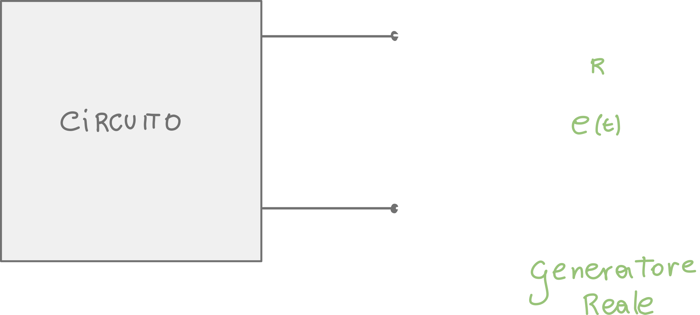

Il **generatore reale di tensione** è costituito da **due elementi che abbiamo giù visto**:

1. Generatore ideale di tensione
2. Resistore

Come faremo con ogni dipolo, dobbiamo andare ad analizzarlo: la prima cosa che facciamo è stabilire una convenzione, in questo caso adottiamo quella del **generatore**: andiamo quindi a riportare differenza di potenziale e verso della corrente; facciamo lo stesso anche per **l'interno del generatore**:

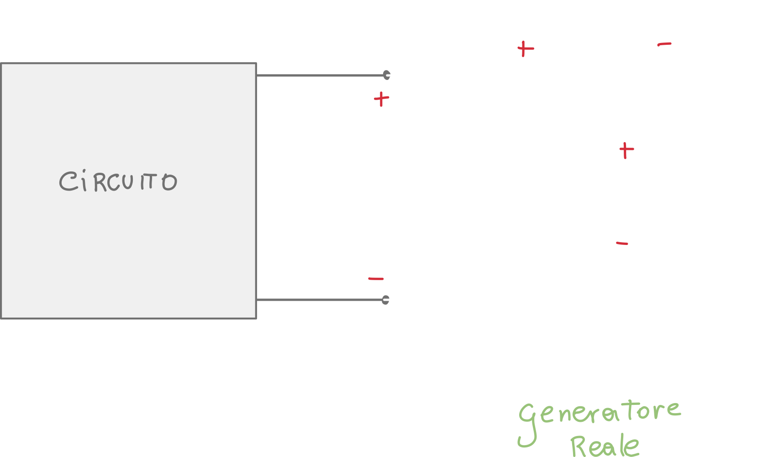

Per **ricavare l'equazione caratteristica** abbiamo diversi strumenti a nostra disposizione: **le leggi di Kirchhoff e le caratteristiche dei singoli bipoli.**

## Derivazione dell'equazione caratteristica del generatore reale

Possiamo trovare l'equazione caratteristica sfruttando sia le leggi di Kirchhoff sia grazie alle equazioni caratteristiche dei singoli componenti:

### LKT

Individuiamo la maglia del circuito e scriviamo la legge di Kirchhoff per le tensioni:

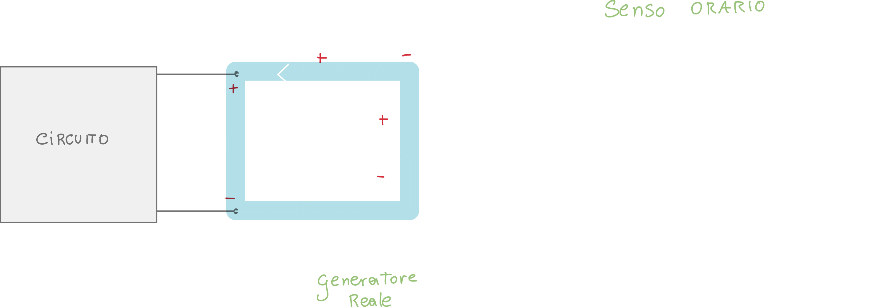

### Equazioni caratteristiche dei dipoli coinvolti

 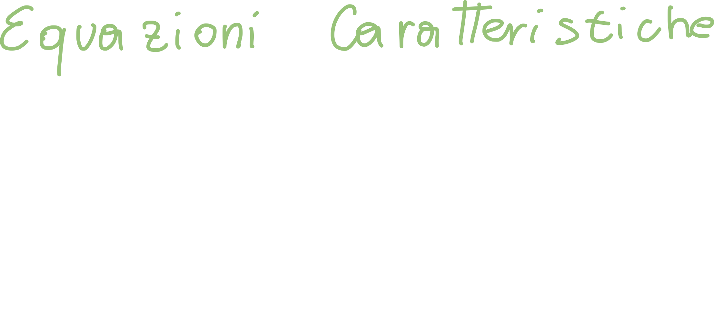

---

Possiamo mettere tutto insieme in modo da trovare finalmente l'equazione caratteristica:

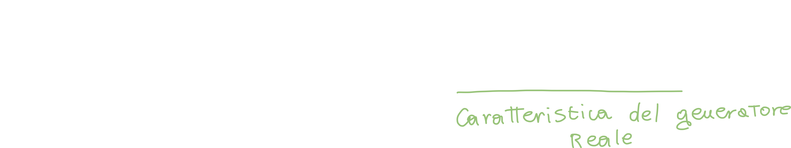

**N.B.** R è la resistenza interna del generatore.

## Esempio di applicazione

La formula E0/R è utilizzata per calcolare la corrente in un circuito quando la resistenza è costante e si applica una tensione E0.

La corrente di cortocircuito si riferisce alla corrente massima che può fluire attraverso un circuito quando i punti di tensione sono collegati direttamente insieme, creando un percorso di bassissima resistenza. In pratica, quando si verifica un cortocircuito, la resistenza del circuito diventa molto vicina allo zero, permettendo un flusso di corrente elevato.

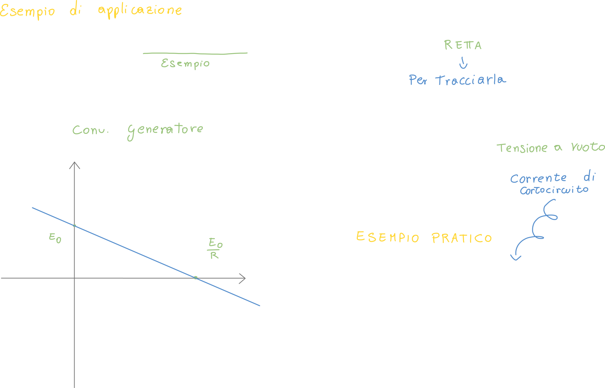

- Nel **secondo quadrante** il bipolo **assorbe corrente**.
- Nel **primo quadrante** il bipolo **eroga corrente**.
  Quindi in ogni momento (nel primo quadrante) la potenza erogata è maggiore di zero.

Nel grafico, il **valore della potenza erogata** è **l'area sottesa al grafico**:

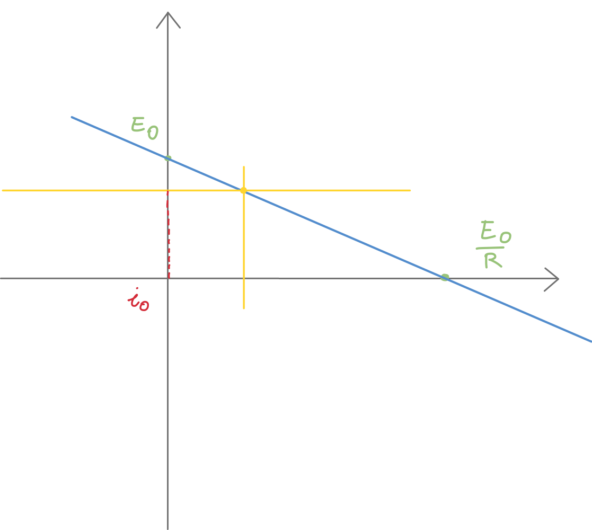

- **A vuoto** Pe = 0
- **In corto circuito** Pe = 0

# Potenze massime erogabili

Come facciamo a trovare la **potenza massima erogabile da un dipolo?**

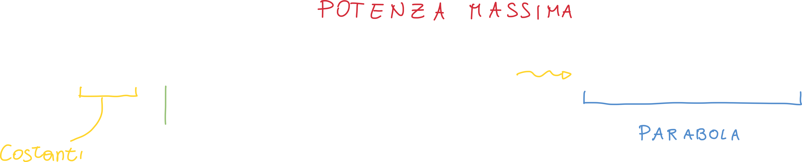

Otteniamo la potenza come *funzione della corrente*: possiamo sfruttare le nostre conoscenze dell'analisi matematica per studiare la funzione:

1. Tracciamo i punti di nostra conoscenza:
   1. A corrente zero, la potenza è zero.
   2. Quando v (differenza di potenziale) è zero e i=E0/R (corrente di cortocircuito) la potenza è zero.
2. La parabola ha una concavità rivolta verso il basso:
   1. Sia per via dei segni dei coefficienti
   2. Sia perché dal grafico precedente abbiamo un intervallo di valori positivi tra le due intersezioni con l'asse x --> concavità verso il basso.
3. Come conseguenza all'affermazione precedente, questa parabola **ha un massimo**: i massimi vengono trovati andando a derivare l'equazione della parabola.

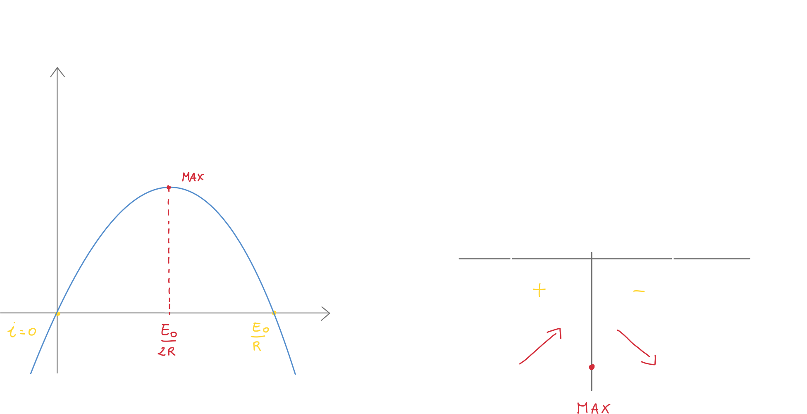

Capiamo quindi che la "corrente massima" (non esiste la corrente massima!), ovvero la corrente per cui si ottiene la **potenza massima** è proprio i=E0/2R; possiamo trovare la potenza massima sostituendo imax nell'equazione della potenza erogata:

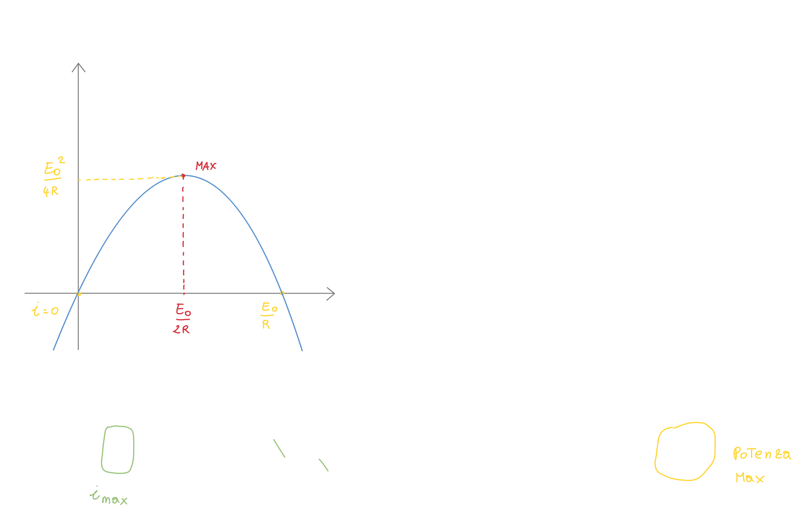

## Potenza erogata minore di zero

Abbiamo anche dei punti in cui la **potenza erogata è minore di zero**:

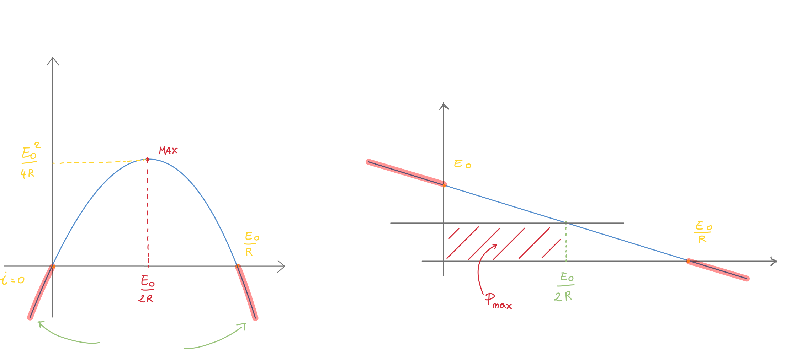

## Energia Erogata

Come sappiamo l'energia è l'integrale tra t0 e t della potenza, e non ci dice molto, siccome essa dipende dalla corrente e dalla tensione:

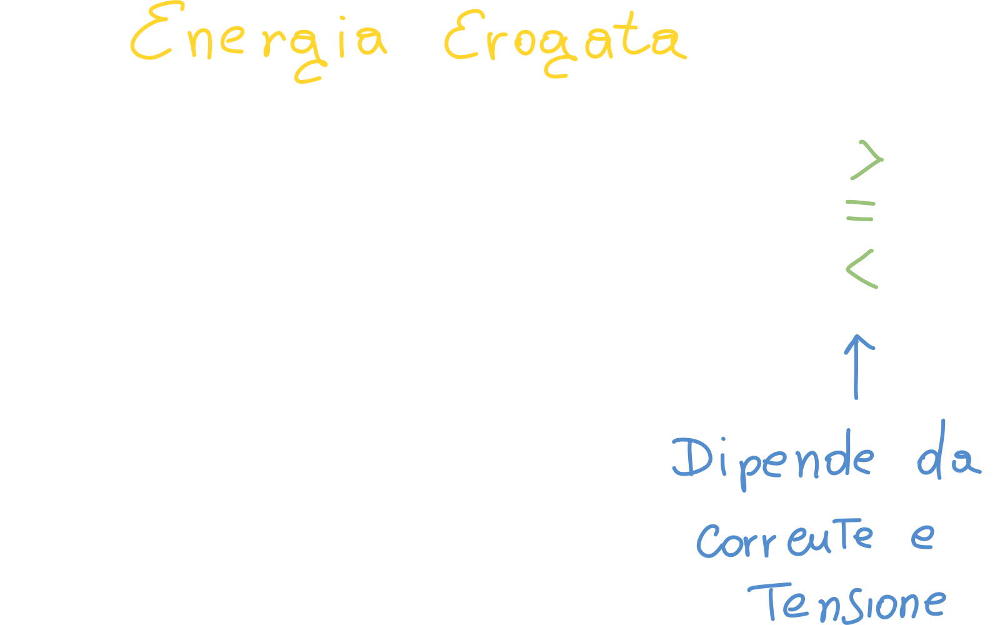

Se però supponiamo che:

- e(t) = E0
- i(t) è sia:
  - i0 > 0
  - i0 < E0/R

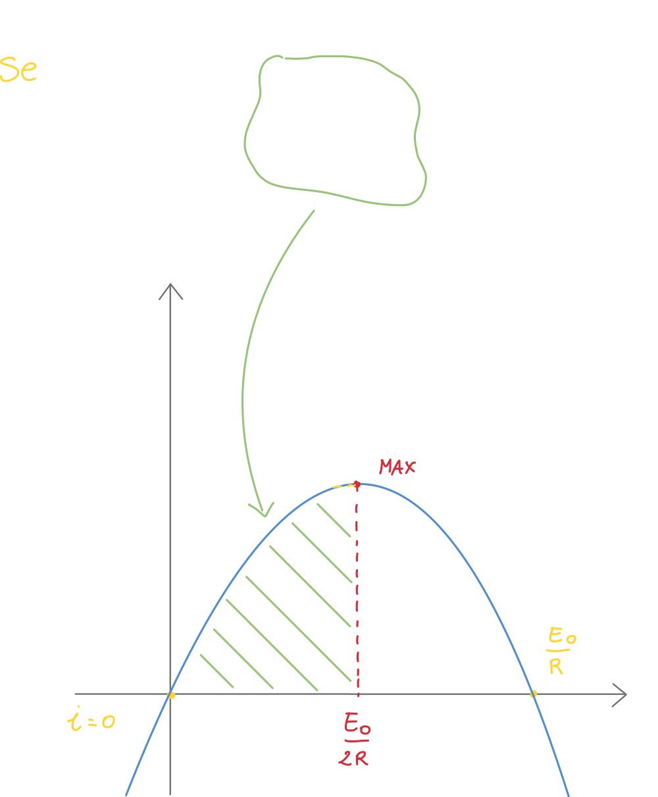

Questa conclusione ci dice che il nostro dipolo **può erogare** (o assorbire) **energia infinita**; questo ovviamente accade in un caso ideale, infatti basti pensare a due possibili scenari:

- Il dipolo è alimentato da una batteria; la batteria prima o poi si scarica --> il dipolo non assorbe energia infinita
- Il dipolo è alimentato da un generatore, che a sua volta è "alimentato" da una seconda **fonte di energia**, che può essere chimica, eolica, geotermica... Questo ci fa capire che anche il generatore assorbe energia da qualche altra parte per darla al nostro dipolo.

## Perché il generatore è "reale"

Il generatore si dice reale perchè la potenza massima erogabile è **limitata**, e vale **E02/4R**. A differenza del generatore reale, quello **ideale**, ha una **resistenza interna nulla**, e quindi:

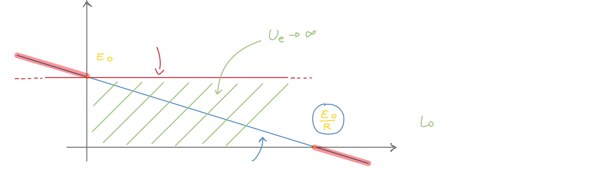

Di conseguenza:

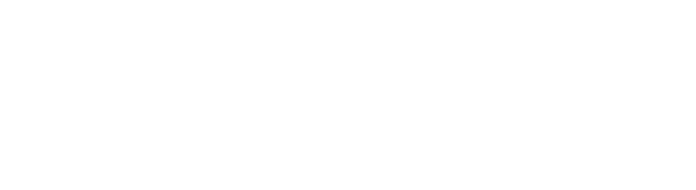

## Differenza tra generatori reali ed ideali

### Generatore reale di tensione

- Potenza massima erogabile: **limitata**.
- Energia massima erogabile: **non limitata**.

### Generatore ideale di tensione

- Potenza massima erogabile: **non limitata**.
- Energia massima erogabile: **non limitata**.

## Caratteristica con la convenzione dell'utilizzatore

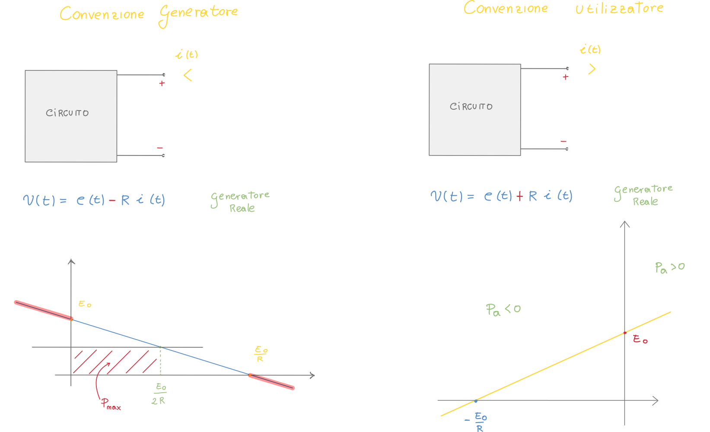

# Bipolo Generatore reale di Corrente

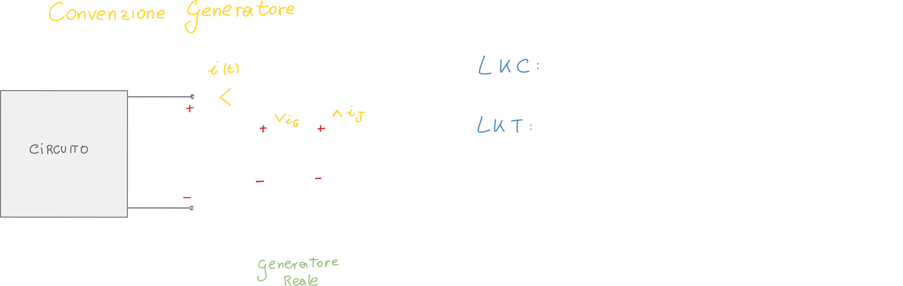

Possiamo scrivere le equazioni caratteristiche delle singole componenti per giungere alla relazione caratteristica del componente intero:

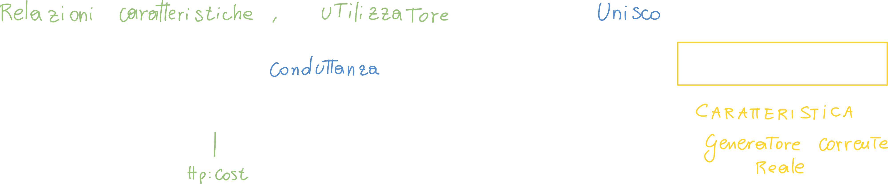

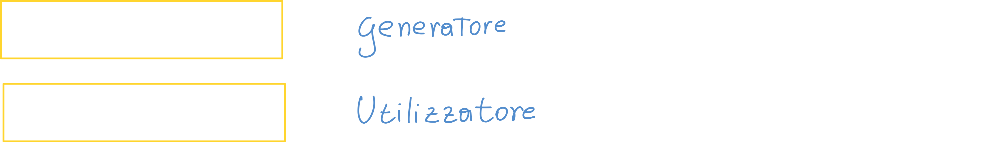
