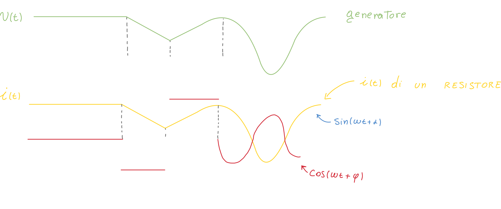

# Bipoli Tempo-Varianti

## Bipolo interruttore

Il bipolo interruttore può essere **aperto** o **chiuso**:

Il fatto che **lo stato dell'interruttore** (aperto o chiuso) **dipende dal tempo**, permette all'interruttore di far parte dei bipoli **tempo-varianti**; possiamo infatti dire "in questo istante l'interruttore è aperto/chiuso".

Il bipolo interruttore è un bipolo di tipo **lineare a-dinamico tempo-variante**:

- La caratteristica è lineare, perchè i(t)=0 / v(t)=0è lineare
- E' a-dinamico perchè le caratteristiche sono **istantanee**

## Bipolo Resistore tempo-variante

Un altro esempio di bipolo tempo-variante può essere la seguente:

La sua caratteristica ci dice che passato il tempo 3 secondi, la sua corrente cambia; potrebbe essere un **resistore**:

### Il potenziometro

Il potenziometro è un esempio di un resistore tempo-variante.

> Per angolo si intende l'angolo fisico del potenziometro; infatti la manopola del potenziometro è fisicamente collegata ad un "braccio" che scorre lungo la resistenza interna.

---

## Recap dei dipoli visti finora

Finora abbiamo visto i dipoli:

1. Lineari
2. A-Dinamici
3. Tempo-invarianti (tutti i resistori visti fino all'interruttore e al potenziometro).
4. Tempo-varianti (la loro caratteristica non dipende dal tempo).
5. Passivi - Strettamente passivi
6. Attivi 
   I bipoli generatori ideali e reali sono bipoli **attivi**, perché esiste almeno una condizione di funzionamento in cui il bipolo **eroga** energia al circuito.

Le due ultime definizioni verranno approfondite nella lezione corrente.

 # Bipoli lineari Dinamici

## Il Condensatore

Il condensatore è un dispositivo in cui possiamo **accumulare della carica elettrica**.

Se applichiamo una differenza di potenziale (ovvero colleghiamo il condensatore ad una batteria / generatore), delle cariche tenderanno ad accumularsi sulle due piastre del condensatore.

La nostra ipotesi di lavoro è che **la differenza di potenziale è positiva**, e quindi la piastra collegata ad A si carica positivamente, mentre quella collegata a B si carica negativamente.

> **La capacità è sempre maggiore di zero.**
>
> Questo perché vedremo come l'energia immagazzinata è calcolata a partire dall'integrale della *potenza assorbita* calcolata tra due **intervalli di tempo**; se poniamo uno degli intervalli a zero, otteniamo un solo membro: questo membro **non può essere minore di zero**.

Possiamo definire la grandezza **Farad** che misura proprio la capacità; inoltre, se la distanza tra le piastre è molto più piccola rispetto alla superficie di quest'ultime, possiamo calcolare la capacità del condensatore come:

Possiamo rappresentare con un grafico la retta della caratteristica del condensatore:

Calcolando la tangente dell'angolo compreso tra la retta e l'asse delle x possiamo facilmente trovare il valore corrispondente alla capacità.

### Induzione elettrostatica perfetta

Parliamo di condensatore quando siamo in presenza di **induzione completa** (o perfetta) ovvero quando le cariche su una piastra sono **l'esatto opposto** dell'altra piastra, ovvero se la carica positiva accumulata è l'opposto di quella negativa.

Quando le piastre del condensatore non sono perfettamente **schermate**, si verifica un processo di **induzione** anche su delle piastre che non *dovrebbero* subire induzione:

> Esempio di induzione **non perfetta**.

### Ricavare l'equazione caratteristica del condensatore

#### Caratteristica della corrente

Come sempre stabiliamo una convenzione (utilizzatore i va da +  a -) e quindi stabiliamo una differenza di potenziale (positiva).

Possiamo trovare la corrente  grazie ad una **superficie Gaussiana**:

- Se la superficie **circonda** il bipolo, allora il flusso sarà zero.
- Se la superficie (chiusa) avvolge **solo una piastra** il flusso non sarà più zero: possiamo usare la legge della **conservazione della carica** per trovare la corrente:

 

Possiamo recuperare la formula della capacità ricavata prima, e mettere insieme le due equazioni:

 

Ci accorgiamo quindi dalla caratteristica che **la corrente dipende dal tempo**, infatti la derivata è dipende proprio dall'istante di tempo in cui viene calcolata.

La derivata è inoltre un **operatore lineare**, il che rende il condensatore un **bipolo dinamico lineare**.

Se calcoliamo la caratteristica dal punto di vista della convenzione del generatore, otterremmo semplicemente il risultato col segno cambiato:

Possiamo inoltre osservare il caso in cui **la capacità è funzione del tempo**:

#### Caratteristica della tensione

Possiamo **integrare entrambi i membri** della caratteristica della corrente in modo da ottenere la tensione:

Si nota quindi che la tensione risultante (rispetto al tempo) **dipende da tutta la "storia passata" della corrente** (infatti compare l'integrale). Inoltre subentra il concetto di **condizione iniziale**: compare infatti *v(t0*).

### Tracciare la corrente di un condensatore

Imponiamo tramite un generatore la tensione al condensatore; otteniamo quindi l'equazione della differenza del potenziale. L'equazione della corrente <u>di un resistore</u> è **identica**.

L'equazione, invece, di un condensatore, è diversa:

Possiamo notare diverse cose, data la tensione:

- La corrente del resistore è **uguale** (più precisamente "ha un andamento identico") alla tensione (questo perchè la caratteristica del resistore non ha derivate/integrali)
- La corrente del condensatore **è la derivata del potenziale** del generatore; infatti la caratteristica del condensatore include una derivata.
- Mentre la corrente del resistore **è una funzione continua**, quella del condensatore **è continua a tratti**.

### Potenza ed energia di un condensatore

Da questo momento facciamo l'ipotesi che la capacità sia **costante nel tempo**.

#### Potenza assorbita da un condensatore

#### Energia immagazzinata di un condensatore

Siccome **la potenza assorbita è la derivata dell'energia**, vuol dire che, della Ua **energia immagazzinata** (perché siccome siamo nella convenzione dell'utilizzatore, il flusso di energia va dal circuito verso i dipoli, perché nel tempo l'energia è *arrivata* al dipolo):

  

> Abbiamo usato il "circa" perché l'energia è immagazzinata in un intervallo di tempo, quindi dovremmo integrare in un range ben definito, come nel seguente caso.
>
> ***** Vedi all'inizio della sezione "condensatore" per scoprire perché la capacità del condensatore è sempre maggiore di zero.

 

---

L'energia assorbita dal condensatore dipende (se non contiamo la *capacità* ed il fattore 1/2), solo da valore della **tensione v** ed i due **istanti  considerati**; 

<u>**L'energia assorbita non dipende dalla storia della tensione**</u> (a differenza del resistore! Dovevamo effettivamente fare l'integrale di *v(t)*).

Ciò significa che la tensione del condensatore **è una grandezza di <u>stato</u>**; questo vuol dire che siccome *l'energia non può presentare discontinuità*, allora **nemmeno la tensione può essere discontinua.**

> **Perché la tensione non è discontinua?**
> Abbiamo visto come la tensione viene calcolata a partire dall'integrale della corrente; l'operazione integrale rende continua anche una funzione discontinua, perché va essenzialmente a *sommare e sottrarre* dei valori.

Consideriamo ora 3 istanti successivi:

Mentre il resistore **dissipa** "immediatamente" l'energia che gli viene fornita, il condensatore **conserva l'energia fornitagli**.

1. Nell'istante t1 la tensione è maggiore rispetto a quella nell'istante t0; questo vuol dire che l'energia *assorbita* è maggiore di zero: il condensatore **sta assorbendo energia**.
2. Nell'istante t0 la tensione invece è minore rispetto a quella in t0; questo vuol dire che l'energia *assorbita* è minore di zero: il condensatore sta **restituendo l'energia assorbita precedentemente**.

*Quanta energia può "erogare" il condensatore?*
Non più dell'energia assorbita precedentemente.

Questo ragionamento ci fa arrivare alla definizione di **bipolo passivo**

### Il condensatore è un bipolo passivo

Il bipolo passivo è un bipolo che **non può restituire più energia di quella che è stata immagazzinata**.

Esempi di bipoli passivi

1. Resistore: il resistore continua ad essere passivo, perchè anche se ha assorbito *zero* energia, continua a restituirne *zero*.
2. Condensatore: il condensatore immagazzina una certa quantità di energia, che quando viene restituita, non supererà mai la quantità immagazzinata precedentemente.
3. Un esempio:  se l'energia è *dell'acqua*, il condensatore è un *serbatoio*: il serbatoio può immagazzinare dell'acqua, ma non potrà restituire già acqua di quanto è stato precedentemente fornito.
   In questo esempio il generatore è una *sorgente d'acqua*.

Sulla base di questo, il condensatore si dice **bipolo conservativo**.

> **Definizione formale**: Un Bipolo si dice passivo se NON è in grado di erogare un'energia maggiore di quanta ne abbia assorbita in precedenza.

## Il solenoide

Il solenoide è il bipolo **duale** del condensatore. 

In elettrotecnica lo rappresentiamo nel seguente modo:

Sappiamo che nel calcolo del flusso, esso è **proporzionale alla corrente** grazie ad un coefficiente detto **autoinduzione o induttanza**.   

 ### Unità di misura del solenoide

**L'induttanza è sempre maggiore di zero** per lo stesso motivo per cui la capacità è sempre maggiore di zero (vedi sopra).

#### Il grafico della caratteristica del solenoide

Come grafico risulta una retta passante per l'origine, il quale coefficiente angolare è proprio l'induttanza:

### Equazione della Tensione nel solenoide

Possiamo trovare la tensione del solenoide andando a combinare la legge di *Faraday-Neumann-Lenz* e la *caratteristica del solenoide*:

> **Perché la legge di Faraday non ha il meno?**
>
> Perché dobbiamo considerare una linea chiusa orientata *gamma*; ed a seconda della convenzione adottata (utilizzatore) definire il verso della corrente; facendo i conti si trova una tensione positiva (con la convenzione dell'utilizzatore).
>
> E` possibile visionare tutti i calcoli nel alla fine del PDF della lezione 6.
>
> Con la **convenzione del generatore** il segno è opposto.

### Equazione della corrente nel solenoide

Possiamo *invertire* l'equazione esprimendo il tutto in termini di corrente:

### Tracciare il grafico della caratteristica del solenoide

Siccome la tensione è una derivata, il grafico è molto simile a quello visto nel condensatore:

### Potenza ed energia del solenoide

#### Potenza assorbita

#### Energia assorbita

---

La corrente è la **grandezza di stato** dell'induttore. Deve essere una funzione continua del tempo. L'induttore condivide gli stessi "aggettivi" del condensatore: esso è infatti un **bipolo lineare, dinamico passivo conservativo.**