# Concetto di equivalenza tra bipoli

Questo corso si basa molto sulla *relazione tensione corrente*; quindi per noi **due bipoli sono equivalenti quando la loro relazione caratteristica tensione-corrente è la stessa**. 
Non ci interessa se all'interno del dipolo ci sono altri dipoli, o se il dipolo è di tipo semplice come potrebbe essere un resistore.

## Configurazione di resistori "in serie"

Due Bipoli sono connessi in *serie* se e solo se essi hanno in comune *in esclusiva* (ovvero il collegamento interessa solo i due bipoli); inoltre **sono attraversati dalla stessa corrente**.

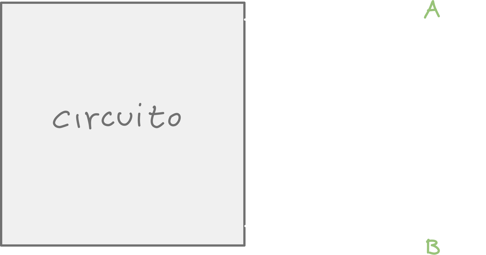

### Resistenza equivalente

Per trovare la resistenza equivalente possiamo usare le leggi di Kirchhoff e le conoscenze acquisite finora:

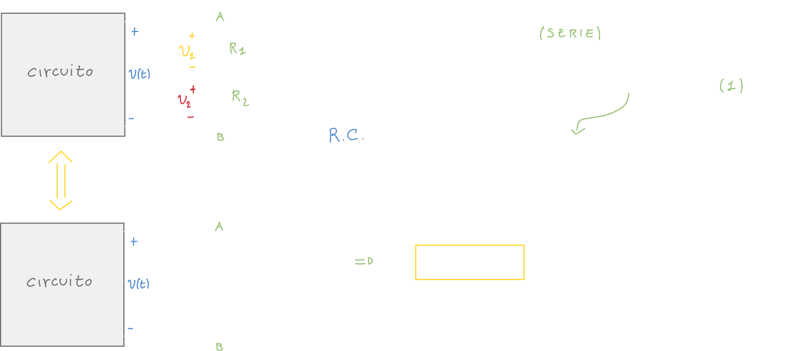

### Regola del partitore di tensione

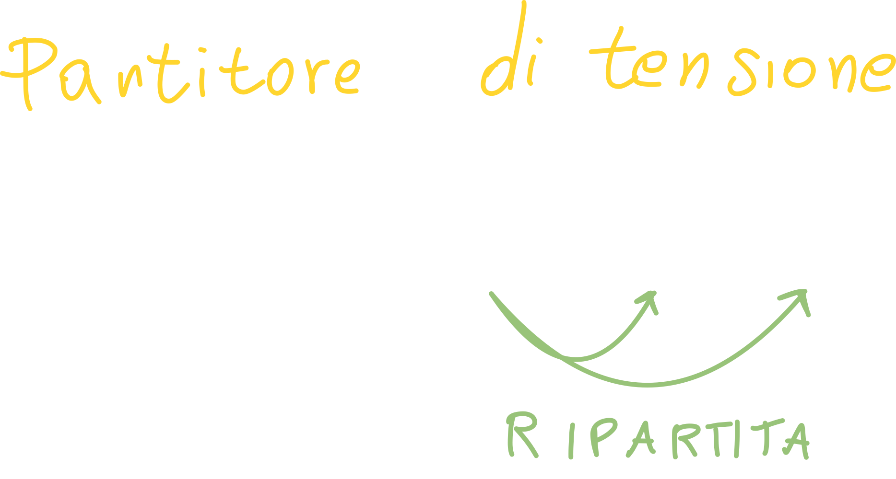

La differenza di potenziale iniziale viene **ripartita** tra i due resistori del circuito: se la tensione totale è, ad esempio, 5V, potrebbe accadere che sul primo resistore "cadono 2V" e sul secondo il resto.

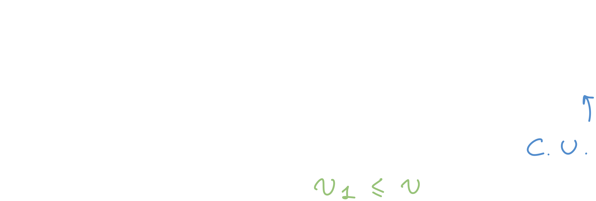

Possiamo estendere il ragionamento ad un caso generale per un circuito con k resistori, con k={1, 2, 3, ..., N}

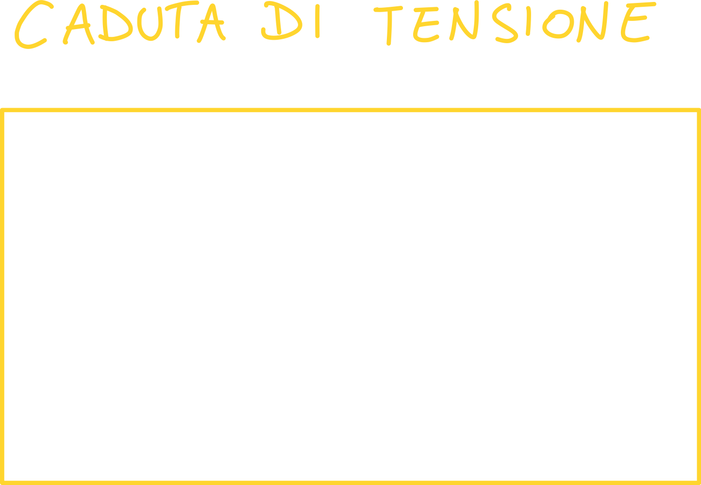

## Configurazione di resistori "in parallelo"

Due bipoli sono connessi **in parallelo** se e solo se hanno i morsetti connessi "a due a due"; inoltre **sono attraversati dalla stessa tensione** --> la differenza di potenziale è la stessa.

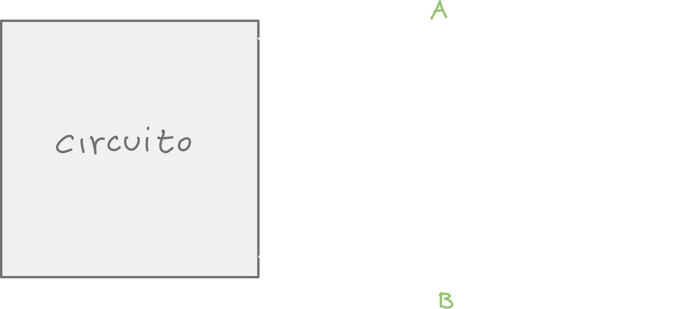

### Conduttanza equivalente

Utilizziamo la conduttanza invece della resistenza in modo da ottenere delle **relazioni duali** a quelle ottenute per il circuito in serie:

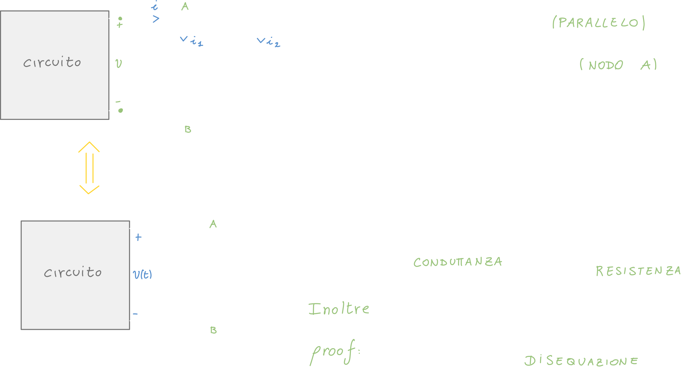

### Regola del partitore di corrente

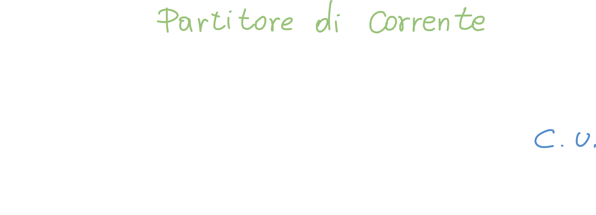

## Generatori ideali in Configurazione "in serie" e "parallelo"

### Generatore ideale di tensione in serie

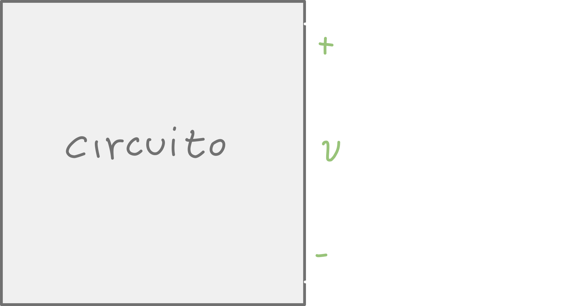

Potremmo vedere il seguente circuito come un esempio: *dato il seguente circuito, a che cosa sono equivalenti (volendoli sostituire con un unico bipolo) i due generatori ideali di tensione connessi in serie?*

Siccome sono collegati in serie, la legge di Kirchhoff per le tensioni (LKT) resta invariata, ma i segni cambiano a seconda dei versi delle correnti:

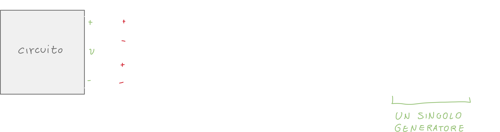

In questo caso possiamo sostituire i due generatori con un singolo generatore che ha come v la somma delle v dei due generatori precedenti; abbiamo usato la convenzione dell'utilizzatore.

### Generatore ideale di corrente e tensione in serie

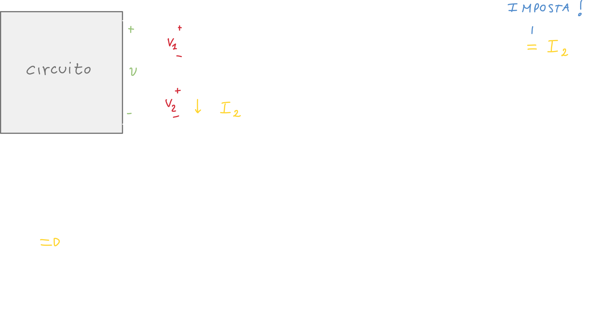

Il dipolo generatore ideale di tensione va ad assorbire la corrente generata dal generatore di corrente, di conseguenza i due generatori sono equivalenti ad un singolo generatore di **corrente**.

> **Un esempio:** le batterie ricaricabili vengono caricate proprio in questo caso; andiamo effettivamente a "reinserire" le carice all'interno delle batterie.

### Generatore ideale di corrente in parallelo

Caso da studiare autonomamente visto a :checkered_flag: 1:10

### Generatore ideale di corrente e tensione in parallelo

Caso da studiare autonomamente visto a :checkered_flag: 1:10

### Generatore ideale di corrente in serie

Caso da studiare autonomamente visto a :checkered_flag: 1:10

### Generatore ideale di tensione in parallelo

Caso da studiare autonomamente visto a :checkered_flag: 1:10

