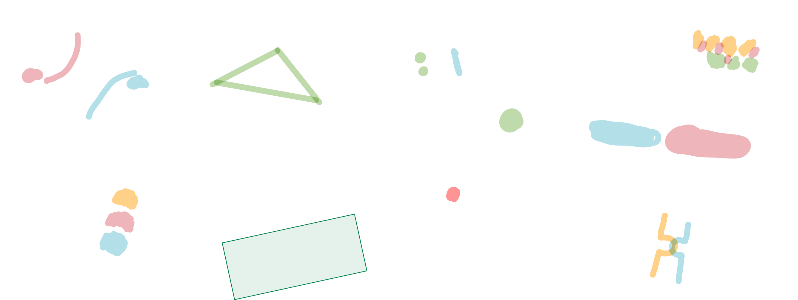

# Elettrotecnica

Repository dedicata all'esame di Elettrotecnica

# Elenco possibili domande orale

- [ ] Sistema Trifase e carico trifase, dimostrazione formula di Millman.
- [ ] Reciprocità, dove viene usata? (Matrici delle conduttanze, proprietà della matrice delle conduttanze).
- [ ] Circuiti del secondo ordine: evoluzione libera a seconda del determinante.

## 1 - Regime Stazionario

- [ ] Potenza
- [ ] Leggi di Kirchhoff
- [ ] Bipoli adinamici
  - [ ] Resistore
  - [ ] Generatori ideali
  - [ ] generatori reali
- [ ] Bipoli dinamici
  - [ ] Condensatore
    - [ ] Potenza
    - [ ] Energia
  - [ ] Induttore
    - [ ] Potenza
    - [ ] Energia
- [ ] Teoria dei grafi
  - [ ] Definizioni
  - [ ] Maglie fondamentali
  - [ ] Insiemi di taglio
  - [ ] Forma matriciale per le leggi di kirchhoff
  - [ ] Forma matriciale per le maglie
  - [ ] Equivalenza triangolo stella
  - [ ] Sovrapposizione degli effetti **[DA FARE]**
  - [ ] Potenziali di nodo - esprimere le tensioni in funzioni della matrice di incidenza
  - [ ] **Conservazione delle potenze elettriche**
  - [ ] Potenza virtuale
    - [ ] **Conservazione delle potenze virtuali** - Tellegen
  - [ ] **Non amplificazione delle tensioni**
  - [ ] **Non amplificazione delle correnti**
- [ ] Partitore di tensione
- [ ] Partitore di corrente
- [ ] thevenin
- [ ] Norton

## 2 - Regime sinusoidale

- [ ] tempo -> fasore
- [ ] fasore -> tempo
- [ ] Proprietà
  - [ ] unicità
  - [ ] linearità
  - [ ] derivazione
- [ ] impedenze
  - [ ] reattanza
  - [ ] ammettenza
- [ ] valore efficace
  - [ ] valore efficace del segnale continuo
  - [ ] valore efficace della sinusoide
- [ ] potenza in regime sinusoidale
  - [ ] potenza istantanea
  - [ ] potenza media
    - [ ] potenze del resistore
    - [ ] potenze dell'induttore
    - [ ] potenze del condensatore
- [ ] Calcolo della potenza in regime fasoriale con il valore efficace
- [ ] **Teorema della conservazione delle potenze complesse - Boucherot**

## 3 - Sistemi trifase

- [ ] Terna simmetrica
  - [ ] Terna simmetrica diretta
  - [ ] Terna simmetrica inversa
  - [ ] Sfasamento dei generatori
- [ ] D.D.P. tra i morsetti **[DA FARE]**
- [ ] Rappresentazione nel piano complesso
  - [ ] La terna simmetrica ha tensione totale zero
- [ ] Carico trifase STELLA-STELLA *senza neutro*
  - [ ] Carico uniforme
  - [ ] Carico non uniforme
  - [ ] **Formula di millmann**
- [ ] Carico trifase STELLA-STELLA *con neutro*
  - [ ] Potenza sprecata attraverso il neutro
- [ ] con Messa a terra vs senza messa a terra
- [ ] **Potenza nei sistemi trifase**

## Doppi Bipoli

- [ ] N - poli
  - [ ] Relazioni caratteristiche
  - [ ] Potenza assorbita **[DA FARE]**
- [ ] **generatori controllati**
  - [ ] Tensione - tensione
  - [ ] tensione - corrente
  - [ ] corrente - tensione
  - [ ] corrente - corrente
  - [ ] Matrici ibride, resistenze, conduttanze
  - [ ] I generatori controllati sono bipoli attivi
- [ ] Proprietà di reciprocità
  - [ ] prima forma - tensione
  - [ ] seconda forma - corrente
  - [ ] terza forma - ibrida

- [ ] matrice delle conduttanze
  - [ ] potenza calcolata con la matrice delle conduttanze
  - [ ] proprietà della matrice delle conduttanze **[DA FARE]**

- [ ] Matrice delle resistenze
  - [ ] Proprietà [DA FARE]

- [ ] Bipoli inerti e non inerti
- [ ] Thevenin per i doppi bipoli
- [ ] Norton per i doppi bipoli

## Elenco argomenti lezioni

### Lezione 1

### Lezione 2

### Lezione 3

### Lezione 4

### Lezione 5

### Lezione 6

### Lezione 7

- Concetto di equivalenza tra dipoli
- Concetto di dipoli in **Serie** e **Parallelo**

### Lezione 8

### Lezione 9

### Lezione 10

- **<u>Metodo</u>** per ispezione
- **<u>Metodo</u>** per sovrapposizione degli effetti
- Equivalenza stella triangolo (**DIM**)

### Lezione 11

- **<u>Metodo</u>** sistematico ridotto per la soluzione dei circuiti: **Metodo dei potenziali dei nodi**
- **<u>Metodo</u>** automatico (**DIM**)
  - Equazioni di Tableau
- Proprietà generali dei circuiti: **Conservazione della potenza elettrica** (**DIM**)
- Potenze virtuali (**DIM**) MOLTO IMPORTANTI
- ***Esercizio** sui potenziali di nodo*
- ***Esercizio** svolto con il procedimento automatico*

### Lezione 12

- Proprietà generale dei circuiti: proprietà di **Non Amplificazione** (**DIM**)
  - Tensioni
  - Correnti
- Equivalenza tra bipoli: **Circuiti Equivalenti di Thevenin e Norton** (**DIM costruttiva**)
- ***Esercizio** sulla resistenza equivalente con il **metodo di ispezione*** (completato :white_check_mark:)
- **Esercizio** su un **circuito ricorsivo** (completato :white_check_mark:)

(Soluzioni degli esercizi nella lezione successiva)

## Regime sinusoidale

### Lezione 13

- Introduzione al regime sinusoidale
- **Esempio** - Risoluzione di un circuito adinamico in regime sinusoidale con il ***<u>metodo</u>** canonico*.
- **Esempio** - Risoluzione di un circuito dinamico in regime sinusoidale con il *metodo canonico*.
- Introduzione (recap) ai numeri complessi
  - Forma esponenziale
  - Forma algebrica
  - Calcolo del modulo
  - Calcolo della fase
  - Formula di Eulero
  - Operazioni con i numeri complessi
    - Somma / Sottrazione
    - Moltiplicazione / Divisione
    - Complesso coniugato
      - Proprietà
- **Soluzioni** agli esercizi della lezione 12

### Lezione 14 - Tensione e corrente in regime sinusoidale

Metodo dei fasori per la risoluzione dei circuiti in regime sinusoidali

- Dal dominio del tempo a quello dei fasori
- Dal dominio dei fasori a quello del tempo (fasori --> sinusoide) (**DIM**)
- **Esempio** di risoluzione di un circuito in regime sinusoidale con il **<u>metodo</u> dei fasori**.
- Equivalenze dominio del tempo - dominio dei fasori
  - Generatori
  - LKT
  - LKC
  - Relazioni caratteristiche
    - Resistori
    - Induttori
    - Condensatori
  - Impedenza
    - Reattanza induttiva
    - Reattanza capacitiva

### Lezione 15 - Potenza ed energia in regime sinusoidale

- Potenza istantanea (**DIM costruttiva**)
- Potenza media (**DIM costruttiva**)
  - Fattore di potenza
- Calcolo della potenza istantanea e media in casi semplici
  - Resistori
  - Induttori
  - Condensatori
- Potenza complessa (**DIM costruttiva**)
  - Potenza apparente
- **<u>Metodo</u>** dei fasori con la convenzione dei valori efficaci

- Conservazione della potenza complessa (teorema di Boucherot) (**DIM**) :checkered_flag: 1:30
  La dimostrazione si incentra sul fatto di poter dimostrare che non solo `AI=0` ma anche `AI*=0`, questo lo si fa andando a mostrare come la parte reale e quella immaginaria di `AI` sono uguali a zero *separatamente*, quindi anche la loro differenza è uguale a zero; la loro differenza è proprio `AI*`.
- Energia assorbita da un dipolo in regime sinusoidale
- Piccolo **Tutorial Matlab** :checkered_flag: 1:50

### Lezione 16 - ESERCITAZIONE REGIME STAZIONARIO

Esercitazione circuiti in regime stazionario

1. Trovare tutte le potenze di resistori e generatori con il metodo per ispezione
2. Metodo della sovrapposizione degli effetti
3. Metodo del circuito equivalente di thevenin
   1. da completare

- Trasformazione di generatori: trasformare un generatore di corrente (con una resistenza in parallelo) in un generatore di tensione (con una resistenza in serie) dimostrato <u>usando Thevenin</u> :checkered_flag: 1:40

### Lezione 17 -ESERCITAZIONE REGIME SINUSOIDALE

- Esercizio: Metodo delle correnti di maglia (Mancanza della lezione precedente)

Esercitazione circuiti in regime sinusoidale

## Sistemi Trifase

### Lezione 18 - Introduzione ai sistemi trifase

- Introduzione ai sistemi trifase
  - **Terna simmetrica** Diretta ed Inversa
  - Gerenatori
  - Carichi elettrici trifase: stella e triangolo
  - **Formula di Millmann**
- Quando il carico dei sistemi trifase non è bilanciato
- Collegamento stella-stella con neutro
- Cenni sulla messa a terra
- Cenni sul salvavita

### Lezione 19

- Potenza nei sistemi trifase (**DIMOSTRAZIONE COSTRUTTIVA**)
  - Potenza istantanea assorbita dal carico
  - Potenza istantanea - media nel dominio dei fasori
- Formule utile per la risoluzione di esercizi di sistemi trifase
- Strumenti di misura
  - Voltmetro
  - Amperometro
  - Wattmetro
  - Multimetro

- Quanti wattmetri sono necessari per misurare la potenza attiva assorbita da un carico trifase generico? [**DA FARE** 1:30]

### Lezione 20

### Lezione 21

### Lezione 22

- Matrice Di Trasmissione di un doppio bipolo lineare [ARGOMENTO AVANZATO - DA FARE]

### Lezione 23

### Lezione 24

### Lezione 25

### Lezione 26

### Lezione 27

### Lezione 28